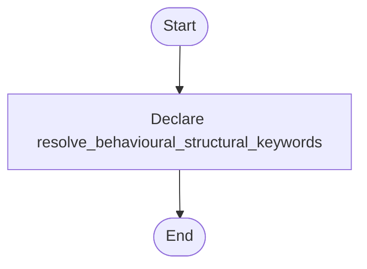

# behavioural_structural_hooks.hpp

- Source: Microservice/Modules/Header/Behavioural/Logic/behavioural_structural_hooks.hpp
- Kind: C++ header
- Lines: 13
- Role: Declares behavioural detection interfaces and structural-hook contracts.
- Chronology: This artifact participates in the repository flow according to the surrounding module or toolchain that loads it.

## Notable Symbols
- resolve_behavioural_structural_keywords

## Direct Dependencies
- string
- vector

## File Outline
### Responsibility

This header implements the compile-time contract for the behavioural subsystem. It defines the interfaces and hook declarations used when the generic parser delegates behavioural structure decisions.

### Position In The Flow

This artifact participates in the repository flow according to the surrounding module or toolchain that loads it.

### Main Surface Area

Declares behavioural detection interfaces and structural-hook contracts. The main surface area is easiest to track through symbols such as resolve_behavioural_structural_keywords. It collaborates directly with string and vector.

## File Activity


## Function Walkthrough

### resolve_behavioural_structural_keywords
This declaration exposes a callable contract without providing the runtime body here. It appears near line 6.

Inside the body, it mainly handles declare a callable contract and let implementation files define the runtime body.

Key operations:
- declare a callable contract
- let implementation files define the runtime body

Activity:
```mermaid
flowchart TD
    Start([resolve_behavioural_structural_keywords()])
    N0[Enter resolve_behavioural_structural_keywords()]
    N1[Declare a callable contract]
    N2[Let implementation files define the runtime body]
    N3[Hand control back to the caller]
    End([Return])
    Start --> N0
    N0 --> N1
    N1 --> N2
    N2 --> N3
    N3 --> End
```

## Documentation Note
- This markdown file is part of the generated docs/Codebase mirror.
- It was generated from the repository state on 2026-04-23 after reading the existing docs corpus and the current source tree.

