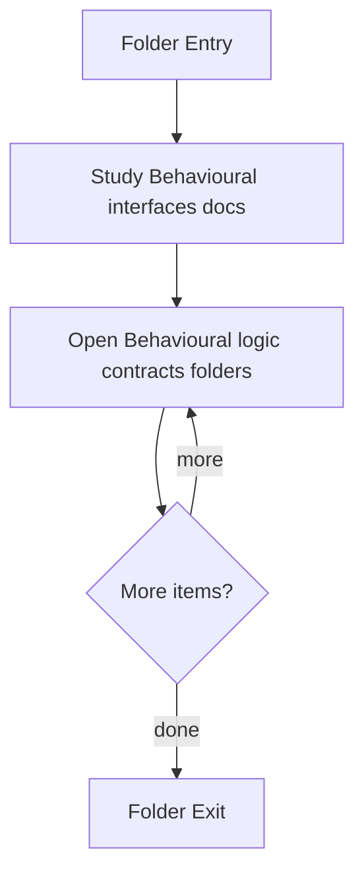

# Behavioural

- Folder: docs/Codebase/Microservice/Modules/Header/Behavioural
- Descendant source docs: 4
- Generated on: 2026-04-23

## Logic Summary
Behavioural detection interface layer.

## Subsystem Story
This folder mixes concrete local documents with deeper child subsystems. Read the local docs to understand the visible behavior first, then descend into the child folders for the lower-level detail that supports it.

## Folder Flow

## Child Folders By Logic
### Behavioural Logic Contracts
These child folders continue the subsystem by covering Behavioural logic and structural-hook contracts..
- Logic/ : Behavioural logic and structural-hook contracts.

## Documents By Logic
### Behavioural Interfaces
These documents explain the local implementation by covering Declares behavioural detection interfaces and structural-hook contracts..
- behavioural_broken_tree.hpp.md : Declares behavioural detection interfaces and structural-hook contracts.
- behavioural_symbol_test.hpp.md : Declares behavioural detection interfaces and structural-hook contracts.

## Reading Hint
- Read the local file docs first for concrete behavior, then descend into the child folders for narrower subsystem details.

