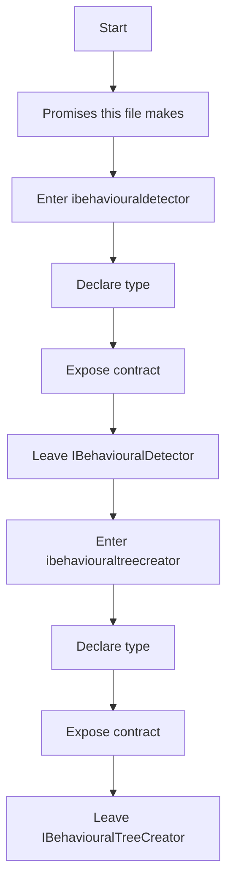
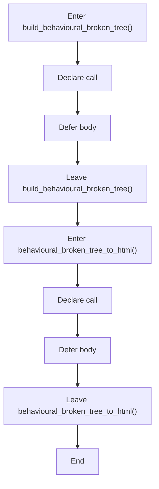
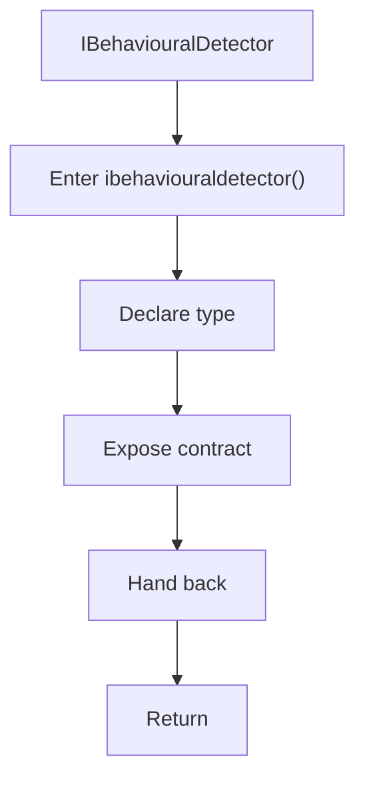
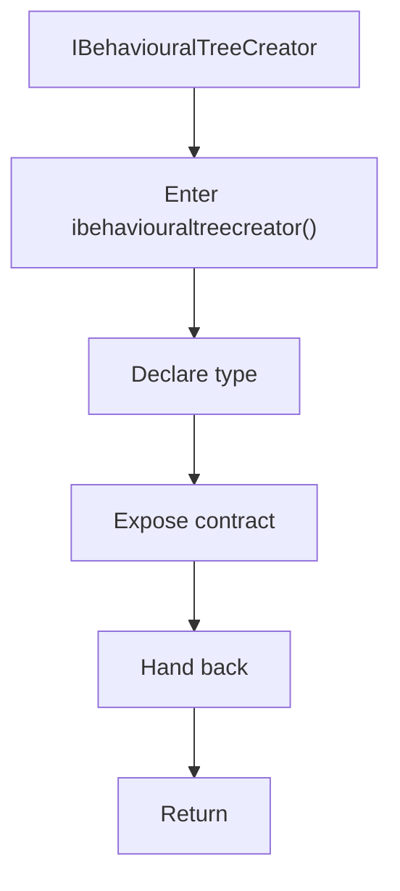
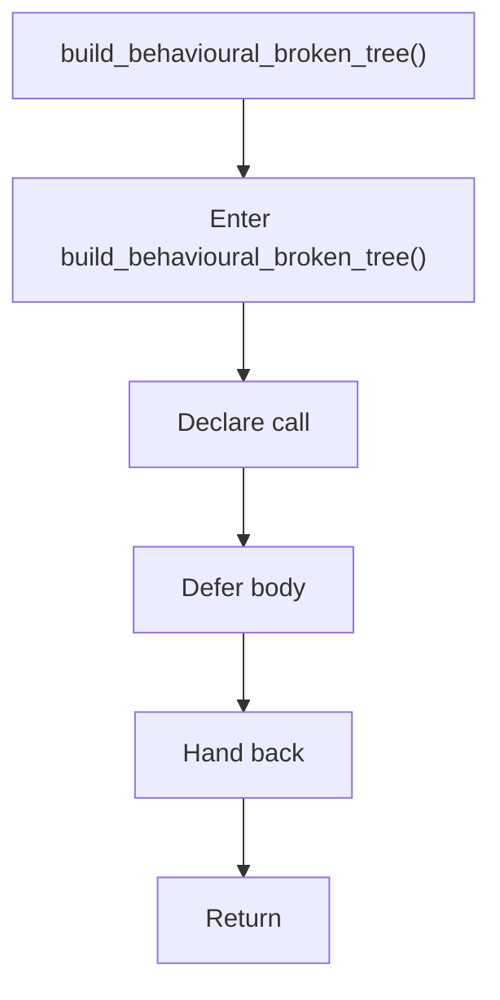
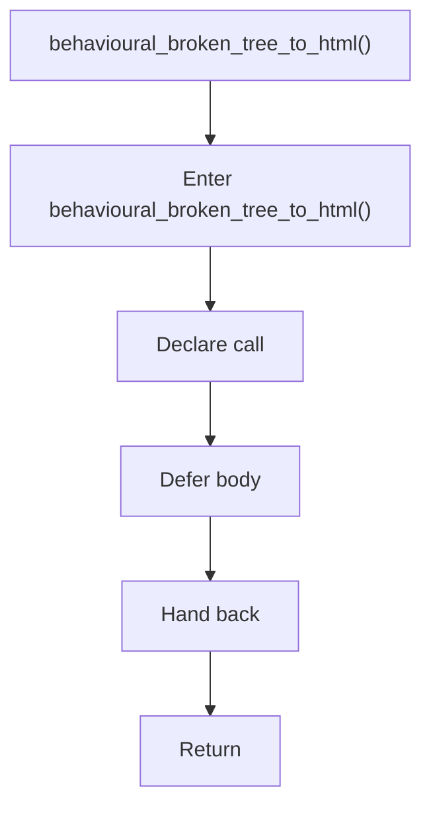

# behavioural_broken_tree.hpp

- Source: Microservice/Modules/Header/Behavioural/behavioural_broken_tree.hpp
- Kind: C++ header
- Lines: 37

## Story
### What Happens Here

This header implements the compile-time contract for the behavioural subsystem. It defines the interfaces and hook declarations used when the generic parser delegates behavioural structure decisions.

### Why It Matters In The Flow

This artifact participates in the repository flow according to the surrounding module or toolchain that loads it.

### What To Watch While Reading

Declares behavioural detection interfaces and structural-hook contracts. The main surface area is easiest to track through symbols such as IBehaviouralDetector, IBehaviouralTreeCreator, detect, and create. It collaborates directly with parse_tree.hpp, string, and vector.

## Program Flow
This diagram follows the action path in plain words. Decision diamonds show where the file can stop, branch, or repeat work instead of simply passing through a straight line.

### Block 1 - Program Flow Details
#### Part 1

#### Part 2

## Reading Map
Read this file as: Declares behavioural detection interfaces and structural-hook contracts.

Where it sits in the run: This artifact participates in the repository flow according to the surrounding module or toolchain that loads it.

Names worth recognizing while reading: IBehaviouralDetector, IBehaviouralTreeCreator, detect, create, build_behavioural_broken_tree, and behavioural_broken_tree_to_html.

It leans on nearby contracts or tools such as parse_tree.hpp, string, and vector.

## Story Groups

### Promises This File Makes
These entries tell the rest of the program what this file can provide.
- IBehaviouralDetector (line 8): Declare a shared type and expose the compile-time contract
- IBehaviouralTreeCreator (line 15): Declare a shared type and expose the compile-time contract
- build_behavioural_broken_tree() (line 29): Declare a callable contract and let implementation files define the runtime body
- behavioural_broken_tree_to_html() (line 34): Declare a callable contract and let implementation files define the runtime body

## Function Stories

### IBehaviouralDetector
This declaration introduces a shared type that other files compile against. It appears near line 8.

Inside the body, it mainly handles declare a shared type and expose the compile-time contract.

What it does:
- declare a shared type
- expose the compile-time contract

Flow:

### IBehaviouralTreeCreator
This declaration introduces a shared type that other files compile against. It appears near line 15.

Inside the body, it mainly handles declare a shared type and expose the compile-time contract.

What it does:
- declare a shared type
- expose the compile-time contract

Flow:

### build_behavioural_broken_tree()
This declaration exposes a callable contract without providing the runtime body here. It appears near line 29.

Inside the body, it mainly handles declare a callable contract and let implementation files define the runtime body.

What it does:
- declare a callable contract
- let implementation files define the runtime body

Flow:

### behavioural_broken_tree_to_html()
This declaration exposes a callable contract without providing the runtime body here. It appears near line 34.

Inside the body, it mainly handles declare a callable contract and let implementation files define the runtime body.

What it does:
- declare a callable contract
- let implementation files define the runtime body

Flow:

## Documentation Note
- This markdown file is part of the generated docs/Codebase mirror.
- It was generated from the repository state on 2026-04-23 after reading the existing docs corpus and the current source tree.
