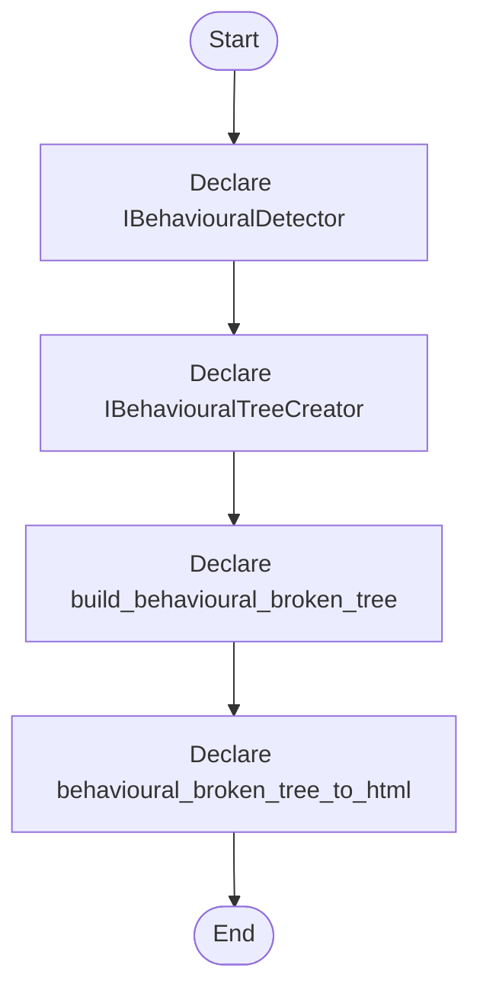

# behavioural_broken_tree.hpp

- Source: Microservice/Modules/Header/Behavioural/behavioural_broken_tree.hpp
- Kind: C++ header
- Lines: 37
- Role: Declares behavioural detection interfaces and structural-hook contracts.
- Chronology: This artifact participates in the repository flow according to the surrounding module or toolchain that loads it.

## Notable Symbols
- IBehaviouralDetector
- IBehaviouralTreeCreator
- detect
- create
- build_behavioural_broken_tree
- behavioural_broken_tree_to_html

## Direct Dependencies
- parse_tree.hpp
- string
- vector

## File Outline
### Responsibility

This header implements the compile-time contract for the behavioural subsystem. It defines the interfaces and hook declarations used when the generic parser delegates behavioural structure decisions.

### Position In The Flow

This artifact participates in the repository flow according to the surrounding module or toolchain that loads it.

### Main Surface Area

Declares behavioural detection interfaces and structural-hook contracts. The main surface area is easiest to track through symbols such as IBehaviouralDetector, IBehaviouralTreeCreator, detect, and create. It collaborates directly with parse_tree.hpp, string, and vector.

## File Activity


## Function Walkthrough

### IBehaviouralDetector
This declaration introduces a shared type that other files compile against. It appears near line 8.

Inside the body, it mainly handles declare a shared type and expose the compile-time contract.

Key operations:
- declare a shared type
- expose the compile-time contract

Activity:
```mermaid
flowchart TD
    Start([IBehaviouralDetector()])
    N0[Enter IBehaviouralDetector()]
    N1[Declare a shared type]
    N2[Expose the compile-time contract]
    N3[Hand control back to the caller]
    End([Return])
    Start --> N0
    N0 --> N1
    N1 --> N2
    N2 --> N3
    N3 --> End
```

### IBehaviouralTreeCreator
This declaration introduces a shared type that other files compile against. It appears near line 15.

Inside the body, it mainly handles declare a shared type and expose the compile-time contract.

Key operations:
- declare a shared type
- expose the compile-time contract

Activity:
```mermaid
flowchart TD
    Start([IBehaviouralTreeCreator()])
    N0[Enter IBehaviouralTreeCreator()]
    N1[Declare a shared type]
    N2[Expose the compile-time contract]
    N3[Hand control back to the caller]
    End([Return])
    Start --> N0
    N0 --> N1
    N1 --> N2
    N2 --> N3
    N3 --> End
```

### build_behavioural_broken_tree
This declaration exposes a callable contract without providing the runtime body here. It appears near line 29.

Inside the body, it mainly handles declare a callable contract and let implementation files define the runtime body.

Key operations:
- declare a callable contract
- let implementation files define the runtime body

Activity:
```mermaid
flowchart TD
    Start([build_behavioural_broken_tree()])
    N0[Enter build_behavioural_broken_tree()]
    N1[Declare a callable contract]
    N2[Let implementation files define the runtime body]
    N3[Hand control back to the caller]
    End([Return])
    Start --> N0
    N0 --> N1
    N1 --> N2
    N2 --> N3
    N3 --> End
```

### behavioural_broken_tree_to_html
This declaration exposes a callable contract without providing the runtime body here. It appears near line 34.

Inside the body, it mainly handles declare a callable contract and let implementation files define the runtime body.

Key operations:
- declare a callable contract
- let implementation files define the runtime body

Activity:
```mermaid
flowchart TD
    Start([behavioural_broken_tree_to_html()])
    N0[Enter behavioural_broken_tree_to_html()]
    N1[Declare a callable contract]
    N2[Let implementation files define the runtime body]
    N3[Hand control back to the caller]
    End([Return])
    Start --> N0
    N0 --> N1
    N1 --> N2
    N2 --> N3
    N3 --> End
```

## Documentation Note
- This markdown file is part of the generated docs/Codebase mirror.
- It was generated from the repository state on 2026-04-23 after reading the existing docs corpus and the current source tree.

