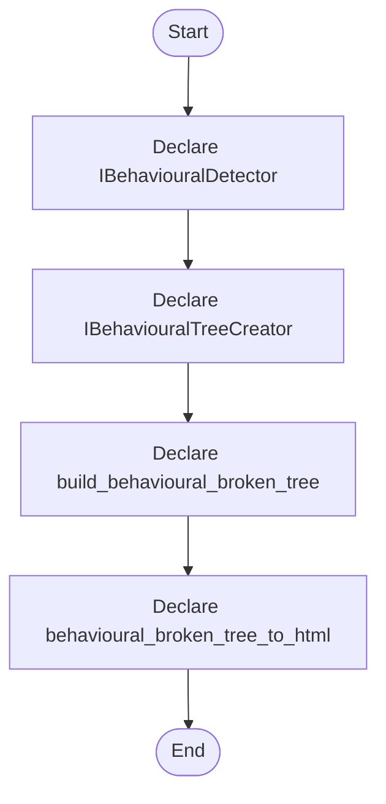

# behavioural_broken_tree.hpp

- Source: Microservice/Modules/Header/Behavioural/behavioural_broken_tree.hpp
- Kind: C++ header
- Lines: 37
- Role: Declares behavioural detection interfaces and structural-hook contracts.
- Chronology: This artifact participates in the repository flow according to the surrounding module or toolchain that loads it.

## Notable Symbols
- IBehaviouralDetector
- IBehaviouralTreeCreator
- detect
- create
- build_behavioural_broken_tree
- behavioural_broken_tree_to_html

## Direct Dependencies
- parse_tree.hpp
- string
- vector

## Implementation Story
This header implements the compile-time contract for the behavioural subsystem. It defines the interfaces and hook declarations used when the generic parser delegates behavioural structure decisions. Declares behavioural detection interfaces and structural-hook contracts. This artifact participates in the repository flow according to the surrounding module or toolchain that loads it. The implementation surface is easiest to recognize through symbols such as IBehaviouralDetector, IBehaviouralTreeCreator, detect, and create. In practice it collaborates directly with parse_tree.hpp, string, and vector.

## Activity Diagram

## Documentation Note
- This markdown file is part of the generated docs/Codebase mirror.
- It was generated from the repository state on 2026-04-22 after reading the existing docs corpus and the current source tree.

