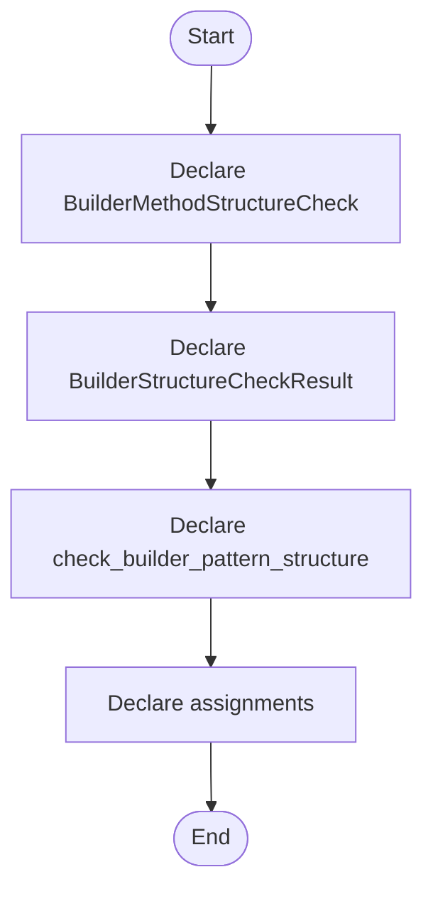

# builder_pattern_logic.hpp

- Source: Microservice/Modules/Header/Creational/Builder/builder_pattern_logic.hpp
- Kind: C++ header
- Lines: 41
- Role: Declares creational-pattern detection and transform interfaces.
- Chronology: This artifact participates in the repository flow according to the surrounding module or toolchain that loads it.

## Notable Symbols
- BuilderMethodStructureCheck
- BuilderStructureCheckResult
- check_builder_pattern_structure
- assignments
- build_builder_pattern_tree

## Direct Dependencies
- creational_broken_tree.hpp
- parse_tree.hpp
- cstddef
- string
- vector

## File Outline
### Responsibility

This header implements the compile-time contract for the creational subsystem. It declares the detectors, transforms, and helper types that the runtime sources later define.

### Position In The Flow

This artifact participates in the repository flow according to the surrounding module or toolchain that loads it.

### Main Surface Area

Declares creational-pattern detection and transform interfaces. The main surface area is easiest to track through symbols such as BuilderMethodStructureCheck, BuilderStructureCheckResult, check_builder_pattern_structure, and assignments. It collaborates directly with creational_broken_tree.hpp, parse_tree.hpp, cstddef, and string.

## File Activity


## Function Walkthrough

### BuilderMethodStructureCheck
This declaration introduces a shared type that other files compile against. It appears near line 10.

Inside the body, it mainly handles declare a shared type and expose the compile-time contract.

Key operations:
- declare a shared type
- expose the compile-time contract

Activity:
```mermaid
flowchart TD
    Start([BuilderMethodStructureCheck()])
    N0[Enter BuilderMethodStructureCheck()]
    N1[Declare a shared type]
    N2[Expose the compile-time contract]
    N3[Hand control back to the caller]
    End([Return])
    Start --> N0
    N0 --> N1
    N1 --> N2
    N2 --> N3
    N3 --> End
```

### BuilderStructureCheckResult
This declaration introduces a shared type that other files compile against. It appears near line 18.

Inside the body, it mainly handles declare a shared type and expose the compile-time contract.

Key operations:
- declare a shared type
- expose the compile-time contract

Activity:
```mermaid
flowchart TD
    Start([BuilderStructureCheckResult()])
    N0[Enter BuilderStructureCheckResult()]
    N1[Declare a shared type]
    N2[Expose the compile-time contract]
    N3[Hand control back to the caller]
    End([Return])
    Start --> N0
    N0 --> N1
    N1 --> N2
    N2 --> N3
    N3 --> End
```

### check_builder_pattern_structure
This declaration exposes a callable contract without providing the runtime body here. It appears near line 32.

Inside the body, it mainly handles declare a callable contract and let implementation files define the runtime body.

Key operations:
- declare a callable contract
- let implementation files define the runtime body

Activity:
```mermaid
flowchart TD
    Start([check_builder_pattern_structure()])
    N0[Enter check_builder_pattern_structure()]
    N1[Declare a callable contract]
    N2[Let implementation files define the runtime body]
    N3[Hand control back to the caller]
    End([Return])
    Start --> N0
    N0 --> N1
    N1 --> N2
    N2 --> N3
    N3 --> End
```

### assignments
This declaration exposes a callable contract without providing the runtime body here. It appears near line 36.

Inside the body, it mainly handles declare a callable contract and let implementation files define the runtime body.

Key operations:
- declare a callable contract
- let implementation files define the runtime body

Activity:
```mermaid
flowchart TD
    Start([assignments()])
    N0[Enter assignments()]
    N1[Declare a callable contract]
    N2[Let implementation files define the runtime body]
    N3[Hand control back to the caller]
    End([Return])
    Start --> N0
    N0 --> N1
    N1 --> N2
    N2 --> N3
    N3 --> End
```

## Documentation Note
- This markdown file is part of the generated docs/Codebase mirror.
- It was generated from the repository state on 2026-04-23 after reading the existing docs corpus and the current source tree.

