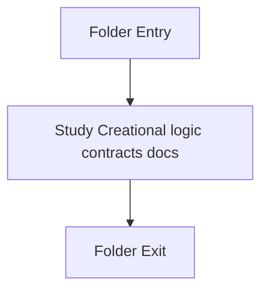

# Logic

- Folder: docs/Codebase/Microservice/Modules/Header/Creational/Logic
- Descendant source docs: 2
- Generated on: 2026-04-23

## Logic Summary
Creational logic and keyword-resolution contracts.

## Subsystem Story
This folder is mostly leaf-level. The local documents here carry the main explanation of the subsystem without requiring much extra descent.

## Folder Flow

## Documents By Logic
### Creational Logic Contracts
These documents explain the local implementation by covering Declares creational-pattern detection and transform interfaces..
- creational_logic_scaffold.hpp.md : Declares creational-pattern detection and transform interfaces.
- creational_structural_hooks.hpp.md : Declares creational-pattern detection and transform interfaces.

## Reading Hint
- This folder is mostly leaf-level. Read the local file docs to understand the logic in this area.

