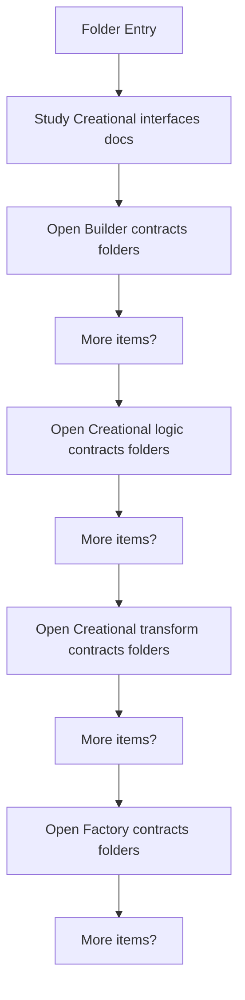
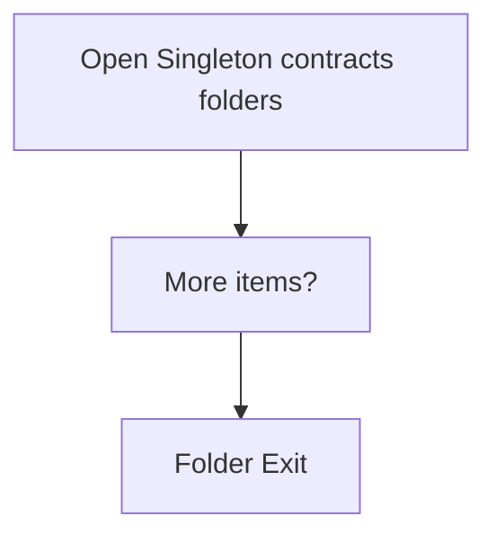

# Creational

- Folder: docs/Codebase/Microservice/Modules/Header/Creational
- Descendant source docs: 10
- Generated on: 2026-04-23

## Logic Summary
Creational detection and transform interface layer.

## Subsystem Story
This folder mixes concrete local documents with deeper child subsystems. Read the local docs to understand the visible behavior first, then descend into the child folders for the lower-level detail that supports it.

## Folder Flow

### Block 1 - Folder Flow Details
#### Part 1

#### Part 2

## Child Folders By Logic
### Builder Contracts
These child folders continue the subsystem by covering Builder-pattern specific contract layer..
- Builder/ : Builder-pattern specific contract layer.

### Creational Logic Contracts
These child folders continue the subsystem by covering Creational logic and keyword-resolution contracts..
- Logic/ : Creational logic and keyword-resolution contracts.

### Creational Transform Contracts
These child folders continue the subsystem by covering Creational transform and evidence-rendering contracts..
- Transform/ : Creational transform and evidence-rendering contracts.

### Factory Contracts
These child folders continue the subsystem by covering Factory-pattern specific contract layer..
- Factory/ : Factory-pattern specific contract layer.

### Singleton Contracts
These child folders continue the subsystem by covering Singleton-pattern specific contract layer..
- Singleton/ : Singleton-pattern specific contract layer.

## Documents By Logic
### Creational Interfaces
These documents explain the local implementation by covering Declares creational-pattern detection and transform interfaces..
- creational_broken_tree.hpp.md : Declares creational-pattern detection and transform interfaces.
- creational_symbol_test.hpp.md : Declares creational-pattern detection and transform interfaces.

## Reading Hint
- Read the local file docs first for concrete behavior, then descend into the child folders for narrower subsystem details.
