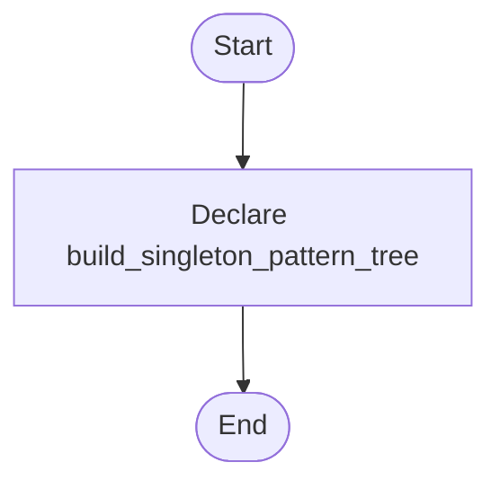

# singleton_pattern_logic.hpp

- Source: Microservice/Modules/Header/Creational/Singleton/singleton_pattern_logic.hpp
- Kind: C++ header
- Lines: 14
- Role: Declares creational-pattern detection and transform interfaces.
- Chronology: This artifact participates in the repository flow according to the surrounding module or toolchain that loads it.

## Notable Symbols
- build_singleton_pattern_tree

## Direct Dependencies
- creational_broken_tree.hpp
- parse_tree.hpp

## File Outline
### Responsibility

This header implements the compile-time contract for the creational subsystem. It declares the detectors, transforms, and helper types that the runtime sources later define.

### Position In The Flow

This artifact participates in the repository flow according to the surrounding module or toolchain that loads it.

### Main Surface Area

Declares creational-pattern detection and transform interfaces. The main surface area is easiest to track through symbols such as build_singleton_pattern_tree. It collaborates directly with creational_broken_tree.hpp and parse_tree.hpp.

## File Activity


## Function Walkthrough

### build_singleton_pattern_tree
This declaration exposes a callable contract without providing the runtime body here. It appears near line 11.

Inside the body, it mainly handles declare a callable contract and let implementation files define the runtime body.

Key operations:
- declare a callable contract
- let implementation files define the runtime body

Activity:
```mermaid
flowchart TD
    Start([build_singleton_pattern_tree()])
    N0[Enter build_singleton_pattern_tree()]
    N1[Declare a callable contract]
    N2[Let implementation files define the runtime body]
    N3[Hand control back to the caller]
    End([Return])
    Start --> N0
    N0 --> N1
    N1 --> N2
    N2 --> N3
    N3 --> End
```

## Documentation Note
- This markdown file is part of the generated docs/Codebase mirror.
- It was generated from the repository state on 2026-04-23 after reading the existing docs corpus and the current source tree.

