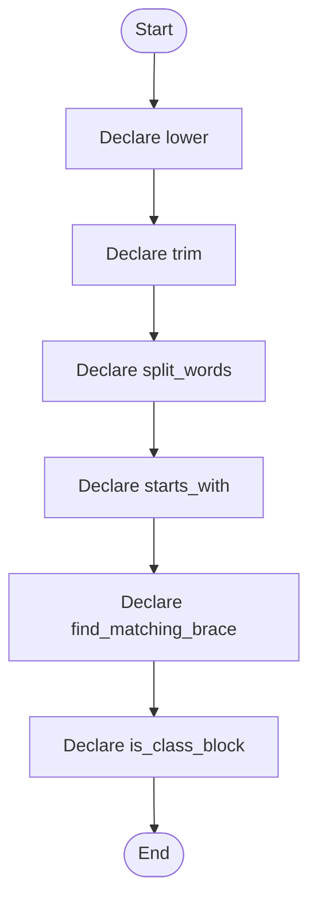

# creational_code_generator_internal.hpp

- Source: Microservice/Modules/Header/Creational/Transform/creational_code_generator_internal.hpp
- Kind: C++ header
- Lines: 85
- Role: Declares creational-pattern detection and transform interfaces.
- Chronology: This artifact participates in the repository flow according to the surrounding module or toolchain that loads it.

## Notable Symbols
- lower
- trim
- split_words
- starts_with
- find_matching_brace
- is_class_block
- is_function_block
- class_name_from_signature
- function_name_from_signature
- inject_singleton_accessor
- rewrite_class_instantiations_to_singleton_references
- extract_crucial_class_names

## Direct Dependencies
- parse_tree.hpp
- parse_tree_code_generator.hpp
- Singleton/singleton_pattern_logic.hpp
- cstddef
- regex
- string
- unordered_map
- vector

## File Outline
### Responsibility

This header implements the compile-time contract for the creational subsystem. It declares the detectors, transforms, and helper types that the runtime sources later define.

### Position In The Flow

This artifact participates in the repository flow according to the surrounding module or toolchain that loads it.

### Main Surface Area

Declares creational-pattern detection and transform interfaces. The main surface area is easiest to track through symbols such as lower, trim, split_words, and starts_with. It collaborates directly with parse_tree.hpp, parse_tree_code_generator.hpp, Singleton/singleton_pattern_logic.hpp, and cstddef.

## File Activity


## Function Walkthrough

### lower
This declaration exposes a callable contract without providing the runtime body here. It appears near line 17.

Inside the body, it mainly handles declare a callable contract and let implementation files define the runtime body.

Key operations:
- declare a callable contract
- let implementation files define the runtime body

Activity:
```mermaid
flowchart TD
    Start([lower()])
    N0[Enter lower()]
    N1[Declare a callable contract]
    N2[Let implementation files define the runtime body]
    N3[Hand control back to the caller]
    End([Return])
    Start --> N0
    N0 --> N1
    N1 --> N2
    N2 --> N3
    N3 --> End
```

### trim
This declaration exposes a callable contract without providing the runtime body here. It appears near line 19.

Inside the body, it mainly handles declare a callable contract and let implementation files define the runtime body.

Key operations:
- declare a callable contract
- let implementation files define the runtime body

Activity:
```mermaid
flowchart TD
    Start([trim()])
    N0[Enter trim()]
    N1[Declare a callable contract]
    N2[Let implementation files define the runtime body]
    N3[Hand control back to the caller]
    End([Return])
    Start --> N0
    N0 --> N1
    N1 --> N2
    N2 --> N3
    N3 --> End
```

### split_words
This declaration exposes a callable contract without providing the runtime body here. It appears near line 20.

Inside the body, it mainly handles declare a callable contract and let implementation files define the runtime body.

Key operations:
- declare a callable contract
- let implementation files define the runtime body

Activity:
```mermaid
flowchart TD
    Start([split_words()])
    N0[Enter split_words()]
    N1[Declare a callable contract]
    N2[Let implementation files define the runtime body]
    N3[Hand control back to the caller]
    End([Return])
    Start --> N0
    N0 --> N1
    N1 --> N2
    N2 --> N3
    N3 --> End
```

### starts_with
This declaration exposes a callable contract without providing the runtime body here. It appears near line 21.

Inside the body, it mainly handles declare a callable contract and let implementation files define the runtime body.

Key operations:
- declare a callable contract
- let implementation files define the runtime body

Activity:
```mermaid
flowchart TD
    Start([starts_with()])
    N0[Enter starts_with()]
    N1[Declare a callable contract]
    N2[Let implementation files define the runtime body]
    N3[Hand control back to the caller]
    End([Return])
    Start --> N0
    N0 --> N1
    N1 --> N2
    N2 --> N3
    N3 --> End
```

### find_matching_brace
This declaration exposes a callable contract without providing the runtime body here. It appears near line 22.

Inside the body, it mainly handles declare a callable contract and let implementation files define the runtime body.

Key operations:
- declare a callable contract
- let implementation files define the runtime body

Activity:
```mermaid
flowchart TD
    Start([find_matching_brace()])
    N0[Enter find_matching_brace()]
    N1[Declare a callable contract]
    N2[Let implementation files define the runtime body]
    N3[Hand control back to the caller]
    End([Return])
    Start --> N0
    N0 --> N1
    N1 --> N2
    N2 --> N3
    N3 --> End
```

### is_class_block
This declaration exposes a callable contract without providing the runtime body here. It appears near line 23.

Inside the body, it mainly handles declare a callable contract and let implementation files define the runtime body.

Key operations:
- declare a callable contract
- let implementation files define the runtime body

Activity:
```mermaid
flowchart TD
    Start([is_class_block()])
    N0[Enter is_class_block()]
    N1[Declare a callable contract]
    N2[Let implementation files define the runtime body]
    N3[Hand control back to the caller]
    End([Return])
    Start --> N0
    N0 --> N1
    N1 --> N2
    N2 --> N3
    N3 --> End
```

### is_function_block
This declaration exposes a callable contract without providing the runtime body here. It appears near line 25.

Inside the body, it mainly handles declare a callable contract and let implementation files define the runtime body.

Key operations:
- declare a callable contract
- let implementation files define the runtime body

Activity:
```mermaid
flowchart TD
    Start([is_function_block()])
    N0[Enter is_function_block()]
    N1[Declare a callable contract]
    N2[Let implementation files define the runtime body]
    N3[Hand control back to the caller]
    End([Return])
    Start --> N0
    N0 --> N1
    N1 --> N2
    N2 --> N3
    N3 --> End
```

### class_name_from_signature
This declaration exposes a callable contract without providing the runtime body here. It appears near line 26.

Inside the body, it mainly handles declare a callable contract and let implementation files define the runtime body.

Key operations:
- declare a callable contract
- let implementation files define the runtime body

Activity:
```mermaid
flowchart TD
    Start([class_name_from_signature()])
    N0[Enter class_name_from_signature()]
    N1[Declare a callable contract]
    N2[Let implementation files define the runtime body]
    N3[Hand control back to the caller]
    End([Return])
    Start --> N0
    N0 --> N1
    N1 --> N2
    N2 --> N3
    N3 --> End
```

### function_name_from_signature
This declaration exposes a callable contract without providing the runtime body here. It appears near line 27.

Inside the body, it mainly handles declare a callable contract and let implementation files define the runtime body.

Key operations:
- declare a callable contract
- let implementation files define the runtime body

Activity:
```mermaid
flowchart TD
    Start([function_name_from_signature()])
    N0[Enter function_name_from_signature()]
    N1[Declare a callable contract]
    N2[Let implementation files define the runtime body]
    N3[Hand control back to the caller]
    End([Return])
    Start --> N0
    N0 --> N1
    N1 --> N2
    N2 --> N3
    N3 --> End
```

### inject_singleton_accessor
This declaration exposes a callable contract without providing the runtime body here. It appears near line 28.

Inside the body, it mainly handles declare a callable contract and let implementation files define the runtime body.

Key operations:
- declare a callable contract
- let implementation files define the runtime body

Activity:
```mermaid
flowchart TD
    Start([inject_singleton_accessor()])
    N0[Enter inject_singleton_accessor()]
    N1[Declare a callable contract]
    N2[Let implementation files define the runtime body]
    N3[Hand control back to the caller]
    End([Return])
    Start --> N0
    N0 --> N1
    N1 --> N2
    N2 --> N3
    N3 --> End
```

### rewrite_class_instantiations_to_singleton_references
This declaration exposes a callable contract without providing the runtime body here. It appears near line 30.

Inside the body, it mainly handles declare a callable contract and let implementation files define the runtime body.

Key operations:
- declare a callable contract
- let implementation files define the runtime body

Activity:
```mermaid
flowchart TD
    Start([rewrite_class_instantiations_to_singleton_references()])
    N0[Enter rewrite_class_instantiations_to_singleton_references()]
    N1[Declare a callable contract]
    N2[Let implementation files define the runtime body]
    N3[Hand control back to the caller]
    End([Return])
    Start --> N0
    N0 --> N1
    N1 --> N2
    N2 --> N3
    N3 --> End
```

### extract_crucial_class_names
This declaration exposes a callable contract without providing the runtime body here. It appears near line 31.

Inside the body, it mainly handles declare a callable contract and let implementation files define the runtime body.

Key operations:
- declare a callable contract
- let implementation files define the runtime body

Activity:
```mermaid
flowchart TD
    Start([extract_crucial_class_names()])
    N0[Enter extract_crucial_class_names()]
    N1[Declare a callable contract]
    N2[Let implementation files define the runtime body]
    N3[Hand control back to the caller]
    End([Return])
    Start --> N0
    N0 --> N1
    N1 --> N2
    N2 --> N3
    N3 --> End
```

### ensure_decision
This declaration exposes a callable contract without providing the runtime body here. It appears near line 36.

Inside the body, it mainly handles declare a callable contract and let implementation files define the runtime body.

Key operations:
- declare a callable contract
- let implementation files define the runtime body

Activity:
```mermaid
flowchart TD
    Start([ensure_decision()])
    N0[Enter ensure_decision()]
    N1[Declare a callable contract]
    N2[Let implementation files define the runtime body]
    N3[Hand control back to the caller]
    End([Return])
    Start --> N0
    N0 --> N1
    N1 --> N2
    N2 --> N3
    N3 --> End
```

### add_reason_if_missing
This declaration exposes a callable contract without providing the runtime body here. It appears near line 40.

Inside the body, it mainly handles declare a callable contract and let implementation files define the runtime body.

Key operations:
- declare a callable contract
- let implementation files define the runtime body

Activity:
```mermaid
flowchart TD
    Start([add_reason_if_missing()])
    N0[Enter add_reason_if_missing()]
    N1[Declare a callable contract]
    N2[Let implementation files define the runtime body]
    N3[Hand control back to the caller]
    End([Return])
    Start --> N0
    N0 --> N1
    N1 --> N2
    N2 --> N3
    N3 --> End
```

### split_lines
This declaration exposes a callable contract without providing the runtime body here. It appears near line 42.

Inside the body, it mainly handles declare a callable contract and let implementation files define the runtime body.

Key operations:
- declare a callable contract
- let implementation files define the runtime body

Activity:
```mermaid
flowchart TD
    Start([split_lines()])
    N0[Enter split_lines()]
    N1[Declare a callable contract]
    N2[Let implementation files define the runtime body]
    N3[Hand control back to the caller]
    End([Return])
    Start --> N0
    N0 --> N1
    N1 --> N2
    N2 --> N3
    N3 --> End
```

### join_lines
This declaration exposes a callable contract without providing the runtime body here. It appears near line 44.

Inside the body, it mainly handles declare a callable contract and let implementation files define the runtime body.

Key operations:
- declare a callable contract
- let implementation files define the runtime body

Activity:
```mermaid
flowchart TD
    Start([join_lines()])
    N0[Enter join_lines()]
    N1[Declare a callable contract]
    N2[Let implementation files define the runtime body]
    N3[Hand control back to the caller]
    End([Return])
    Start --> N0
    N0 --> N1
    N1 --> N2
    N2 --> N3
    N3 --> End
```

### is_config_method_name
This declaration exposes a callable contract without providing the runtime body here. It appears near line 48.

Inside the body, it mainly handles declare a callable contract and let implementation files define the runtime body.

Key operations:
- declare a callable contract
- let implementation files define the runtime body

Activity:
```mermaid
flowchart TD
    Start([is_config_method_name()])
    N0[Enter is_config_method_name()]
    N1[Declare a callable contract]
    N2[Let implementation files define the runtime body]
    N3[Hand control back to the caller]
    End([Return])
    Start --> N0
    N0 --> N1
    N1 --> N2
    N2 --> N3
    N3 --> End
```

### is_monolithic_config_method_name
This declaration exposes a callable contract without providing the runtime body here. It appears near line 50.

Inside the body, it mainly handles declare a callable contract and let implementation files define the runtime body.

Key operations:
- declare a callable contract
- let implementation files define the runtime body

Activity:
```mermaid
flowchart TD
    Start([is_monolithic_config_method_name()])
    N0[Enter is_monolithic_config_method_name()]
    N1[Declare a callable contract]
    N2[Let implementation files define the runtime body]
    N3[Hand control back to the caller]
    End([Return])
    Start --> N0
    N0 --> N1
    N1 --> N2
    N2 --> N3
    N3 --> End
```

### is_monolithic_build_method_name
This declaration exposes a callable contract without providing the runtime body here. It appears near line 51.

Inside the body, it mainly handles declare a callable contract and let implementation files define the runtime body.

Key operations:
- declare a callable contract
- let implementation files define the runtime body

Activity:
```mermaid
flowchart TD
    Start([is_monolithic_build_method_name()])
    N0[Enter is_monolithic_build_method_name()]
    N1[Declare a callable contract]
    N2[Let implementation files define the runtime body]
    N3[Hand control back to the caller]
    End([Return])
    Start --> N0
    N0 --> N1
    N1 --> N2
    N2 --> N3
    N3 --> End
```

### is_build_method_name
This declaration exposes a callable contract without providing the runtime body here. It appears near line 52.

Inside the body, it mainly handles declare a callable contract and let implementation files define the runtime body.

Key operations:
- declare a callable contract
- let implementation files define the runtime body

Activity:
```mermaid
flowchart TD
    Start([is_build_method_name()])
    N0[Enter is_build_method_name()]
    N1[Declare a callable contract]
    N2[Let implementation files define the runtime body]
    N3[Hand control back to the caller]
    End([Return])
    Start --> N0
    N0 --> N1
    N1 --> N2
    N2 --> N3
    N3 --> End
```

### is_operational_method_name
This declaration exposes a callable contract without providing the runtime body here. It appears near line 53.

Inside the body, it mainly handles declare a callable contract and let implementation files define the runtime body.

Key operations:
- declare a callable contract
- let implementation files define the runtime body

Activity:
```mermaid
flowchart TD
    Start([is_operational_method_name()])
    N0[Enter is_operational_method_name()]
    N1[Declare a callable contract]
    N2[Let implementation files define the runtime body]
    N3[Hand control back to the caller]
    End([Return])
    Start --> N0
    N0 --> N1
    N1 --> N2
    N2 --> N3
    N3 --> End
```

### ends_with
This declaration exposes a callable contract without providing the runtime body here. It appears near line 54.

Inside the body, it mainly handles declare a callable contract and let implementation files define the runtime body.

Key operations:
- declare a callable contract
- let implementation files define the runtime body

Activity:
```mermaid
flowchart TD
    Start([ends_with()])
    N0[Enter ends_with()]
    N1[Declare a callable contract]
    N2[Let implementation files define the runtime body]
    N3[Hand control back to the caller]
    End([Return])
    Start --> N0
    N0 --> N1
    N1 --> N2
    N2 --> N3
    N3 --> End
```

### strip_builder_suffix
This declaration exposes a callable contract without providing the runtime body here. It appears near line 56.

Inside the body, it mainly handles declare a callable contract and let implementation files define the runtime body.

Key operations:
- declare a callable contract
- let implementation files define the runtime body

Activity:
```mermaid
flowchart TD
    Start([strip_builder_suffix()])
    N0[Enter strip_builder_suffix()]
    N1[Declare a callable contract]
    N2[Let implementation files define the runtime body]
    N3[Hand control back to the caller]
    End([Return])
    Start --> N0
    N0 --> N1
    N1 --> N2
    N2 --> N3
    N3 --> End
```

### append_unique_token
This declaration exposes a callable contract without providing the runtime body here. It appears near line 57.

Inside the body, it mainly handles declare a callable contract and let implementation files define the runtime body.

Key operations:
- declare a callable contract
- let implementation files define the runtime body

Activity:
```mermaid
flowchart TD
    Start([append_unique_token()])
    N0[Enter append_unique_token()]
    N1[Declare a callable contract]
    N2[Let implementation files define the runtime body]
    N3[Hand control back to the caller]
    End([Return])
    Start --> N0
    N0 --> N1
    N1 --> N2
    N2 --> N3
    N3 --> End
```

### append_unique_line
This declaration exposes a callable contract without providing the runtime body here. It appears near line 59.

Inside the body, it mainly handles declare a callable contract and let implementation files define the runtime body.

Key operations:
- declare a callable contract
- let implementation files define the runtime body

Activity:
```mermaid
flowchart TD
    Start([append_unique_line()])
    N0[Enter append_unique_line()]
    N1[Declare a callable contract]
    N2[Let implementation files define the runtime body]
    N3[Hand control back to the caller]
    End([Return])
    Start --> N0
    N0 --> N1
    N1 --> N2
    N2 --> N3
    N3 --> End
```

### append_unique_lines
This declaration exposes a callable contract without providing the runtime body here. It appears near line 60.

Inside the body, it mainly handles declare a callable contract and let implementation files define the runtime body.

Key operations:
- declare a callable contract
- let implementation files define the runtime body

Activity:
```mermaid
flowchart TD
    Start([append_unique_lines()])
    N0[Enter append_unique_lines()]
    N1[Declare a callable contract]
    N2[Let implementation files define the runtime body]
    N3[Hand control back to the caller]
    End([Return])
    Start --> N0
    N0 --> N1
    N1 --> N2
    N2 --> N3
    N3 --> End
```

### regex_capture_or_empty
This declaration exposes a callable contract without providing the runtime body here. It appears near line 61.

Inside the body, it mainly handles declare a callable contract and let implementation files define the runtime body.

Key operations:
- declare a callable contract
- let implementation files define the runtime body

Activity:
```mermaid
flowchart TD
    Start([regex_capture_or_empty()])
    N0[Enter regex_capture_or_empty()]
    N1[Declare a callable contract]
    N2[Let implementation files define the runtime body]
    N3[Hand control back to the caller]
    End([Return])
    Start --> N0
    N0 --> N1
    N1 --> N2
    N2 --> N3
    N3 --> End
```

### build_monolithic_evidence_view
This declaration exposes a callable contract without providing the runtime body here. It appears near line 62.

Inside the body, it mainly handles declare a callable contract and let implementation files define the runtime body.

Key operations:
- declare a callable contract
- let implementation files define the runtime body

Activity:
```mermaid
flowchart TD
    Start([build_monolithic_evidence_view()])
    N0[Enter build_monolithic_evidence_view()]
    N1[Declare a callable contract]
    N2[Let implementation files define the runtime body]
    N3[Hand control back to the caller]
    End([Return])
    Start --> N0
    N0 --> N1
    N1 --> N2
    N2 --> N3
    N3 --> End
```

### transform_to_singleton_by_class_references
This declaration exposes a callable contract without providing the runtime body here. It appears near line 69.

Inside the body, it mainly handles declare a callable contract and let implementation files define the runtime body.

Key operations:
- declare a callable contract
- let implementation files define the runtime body

Activity:
```mermaid
flowchart TD
    Start([transform_to_singleton_by_class_references()])
    N0[Enter transform_to_singleton_by_class_references()]
    N1[Declare a callable contract]
    N2[Let implementation files define the runtime body]
    N3[Hand control back to the caller]
    End([Return])
    Start --> N0
    N0 --> N1
    N1 --> N2
    N2 --> N3
    N3 --> End
```

### transform_singleton_to_builder
This declaration exposes a callable contract without providing the runtime body here. It appears near line 74.

Inside the body, it mainly handles declare a callable contract and let implementation files define the runtime body.

Key operations:
- declare a callable contract
- let implementation files define the runtime body

Activity:
```mermaid
flowchart TD
    Start([transform_singleton_to_builder()])
    N0[Enter transform_singleton_to_builder()]
    N1[Declare a callable contract]
    N2[Let implementation files define the runtime body]
    N3[Hand control back to the caller]
    End([Return])
    Start --> N0
    N0 --> N1
    N1 --> N2
    N2 --> N3
    N3 --> End
```

### transform_using_registered_rule
This declaration exposes a callable contract without providing the runtime body here. It appears near line 78.

Inside the body, it mainly handles declare a callable contract and let implementation files define the runtime body.

Key operations:
- declare a callable contract
- let implementation files define the runtime body

Activity:
```mermaid
flowchart TD
    Start([transform_using_registered_rule()])
    N0[Enter transform_using_registered_rule()]
    N1[Declare a callable contract]
    N2[Let implementation files define the runtime body]
    N3[Hand control back to the caller]
    End([Return])
    Start --> N0
    N0 --> N1
    N1 --> N2
    N2 --> N3
    N3 --> End
```

## Documentation Note
- This markdown file is part of the generated docs/Codebase mirror.
- It was generated from the repository state on 2026-04-23 after reading the existing docs corpus and the current source tree.

