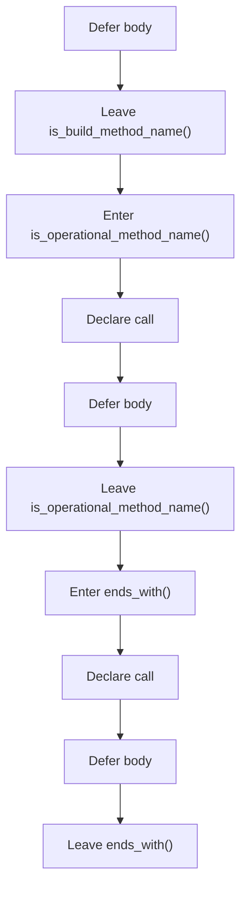
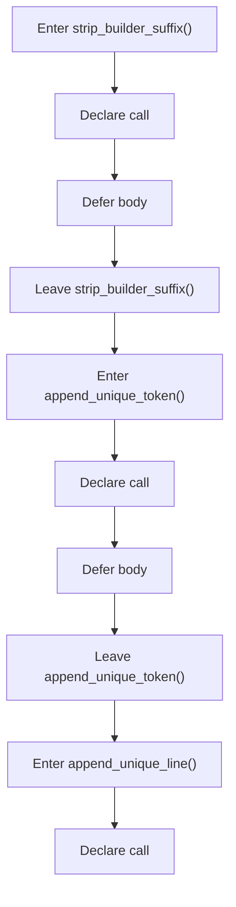
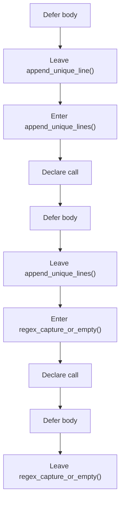
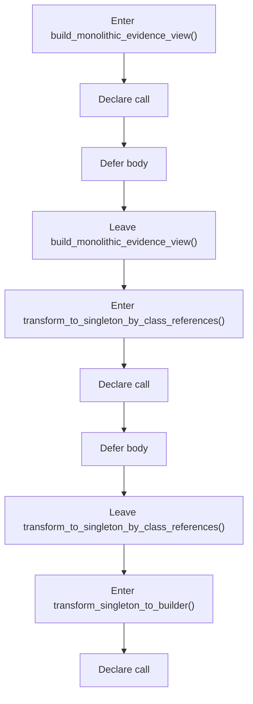
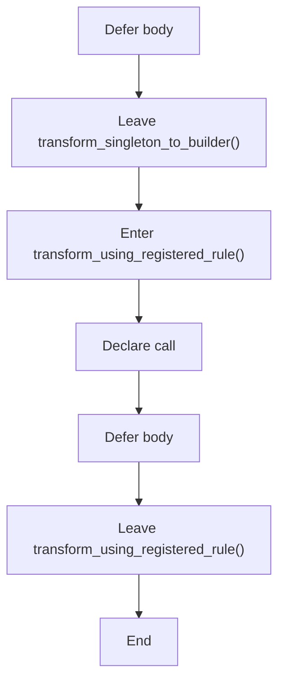

# creational_code_generator_internal_program_flow_02.hpp

- Source document: [creational_code_generator_internal.hpp.md](../creational_code_generator_internal.hpp.md)
- Purpose: decoupled implementation logic for a future code unit.

#### Part 9

#### Part 10

#### Part 11

#### Part 12

#### Part 13

