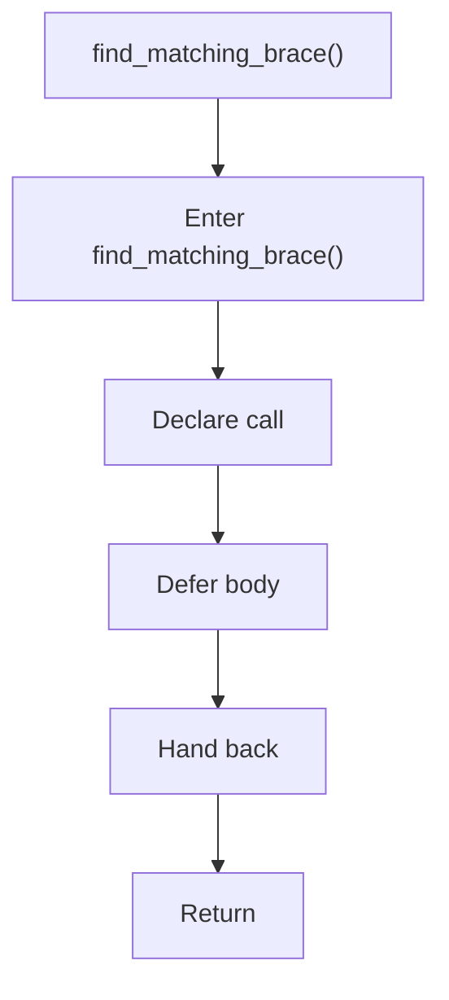

# find_matching_brace.hpp

- Source document: [creational_code_generator_internal.hpp.md](../../creational_code_generator_internal.hpp.md)
- Purpose: decoupled implementation logic for a future code unit.

### find_matching_brace()
This declaration exposes a callable contract without providing the runtime body here. It appears near line 22.

Inside the body, it mainly handles declare a callable contract and let implementation files define the runtime body.

What it does:
- declare a callable contract
- let implementation files define the runtime body

Flow:

