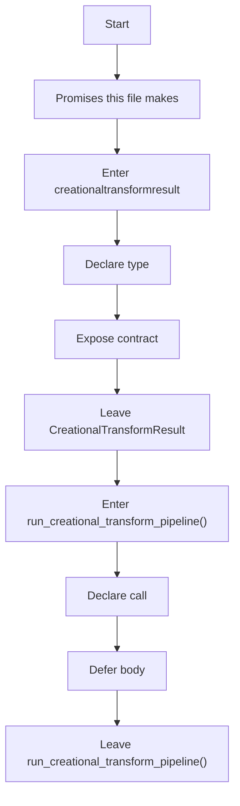
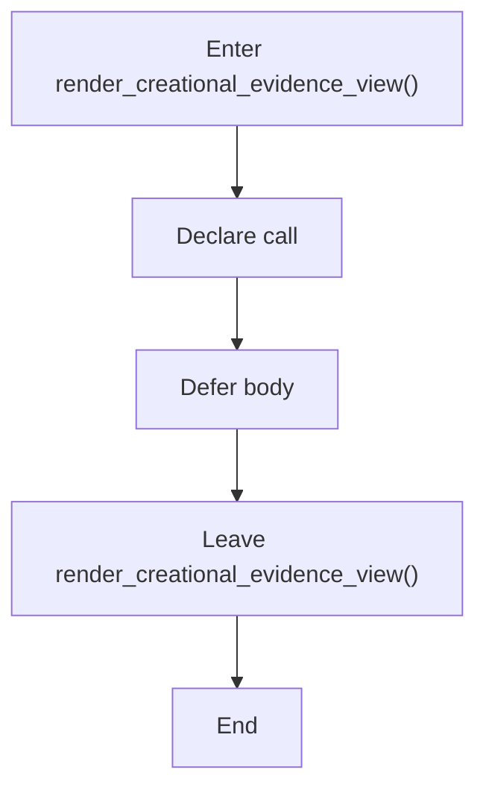
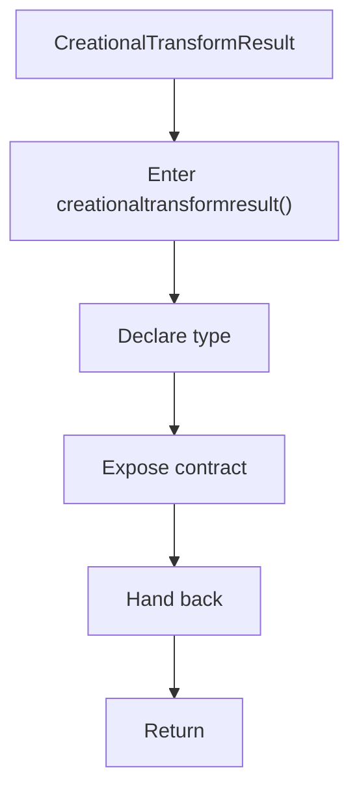
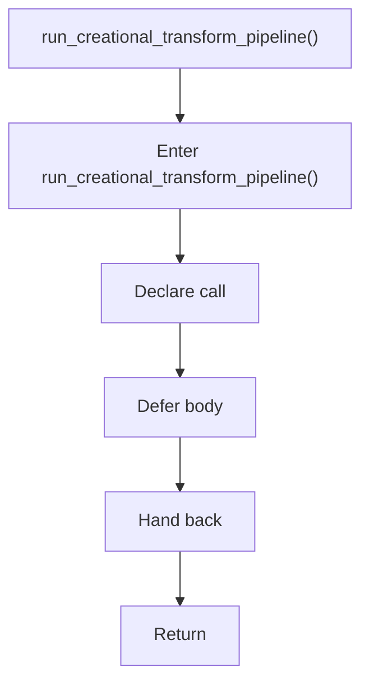
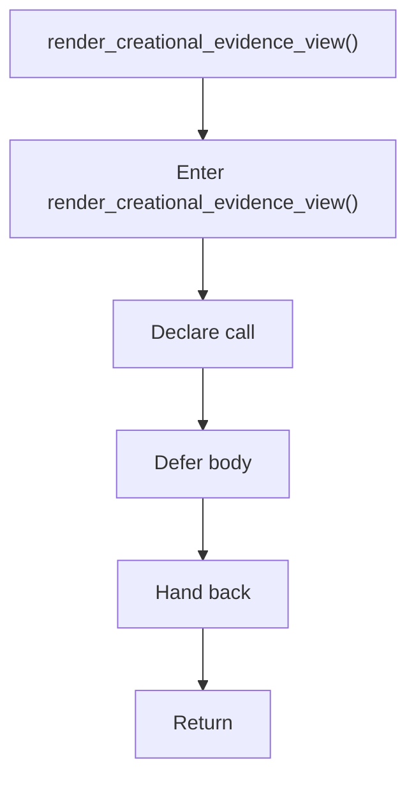

# creational_transform_pipeline.hpp

- Source: Microservice/Modules/Header/Creational/Transform/creational_transform_pipeline.hpp
- Kind: C++ header
- Lines: 28

## Story
### What Happens Here

This header implements the compile-time contract for the creational subsystem. It declares the detectors, transforms, and helper types that the runtime sources later define.

### Why It Matters In The Flow

This artifact participates in the repository flow according to the surrounding module or toolchain that loads it.

### What To Watch While Reading

Declares creational-pattern detection and transform interfaces. The main surface area is easiest to track through symbols such as CreationalTransformResult, run_creational_transform_pipeline, and render_creational_evidence_view. It collaborates directly with parse_tree_code_generator.hpp, string, and vector.

## Program Flow
This diagram follows the action path in plain words. Decision diamonds show where the file can stop, branch, or repeat work instead of simply passing through a straight line.

### Block 1 - Program Flow Details
#### Part 1

#### Part 2

## Reading Map
Read this file as: Declares creational-pattern detection and transform interfaces.

Where it sits in the run: This artifact participates in the repository flow according to the surrounding module or toolchain that loads it.

Names worth recognizing while reading: CreationalTransformResult, run_creational_transform_pipeline, and render_creational_evidence_view.

It leans on nearby contracts or tools such as parse_tree_code_generator.hpp, string, and vector.

## Story Groups

### Promises This File Makes
These entries tell the rest of the program what this file can provide.
- CreationalTransformResult (line 8): Declare a shared type and expose the compile-time contract
- run_creational_transform_pipeline() (line 14): Declare a callable contract and let implementation files define the runtime body
- render_creational_evidence_view() (line 19): Declare a callable contract and let implementation files define the runtime body

## Function Stories

### CreationalTransformResult
This declaration introduces a shared type that other files compile against. It appears near line 8.

Inside the body, it mainly handles declare a shared type and expose the compile-time contract.

What it does:
- declare a shared type
- expose the compile-time contract

Flow:

### run_creational_transform_pipeline()
This declaration exposes a callable contract without providing the runtime body here. It appears near line 14.

Inside the body, it mainly handles declare a callable contract and let implementation files define the runtime body.

What it does:
- declare a callable contract
- let implementation files define the runtime body

Flow:

### render_creational_evidence_view()
This declaration exposes a callable contract without providing the runtime body here. It appears near line 19.

Inside the body, it mainly handles declare a callable contract and let implementation files define the runtime body.

What it does:
- declare a callable contract
- let implementation files define the runtime body

Flow:

## Documentation Note
- This markdown file is part of the generated docs/Codebase mirror.
- It was generated from the repository state on 2026-04-23 after reading the existing docs corpus and the current source tree.
