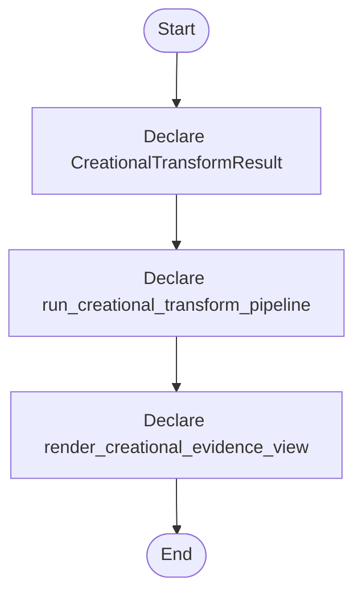

# creational_transform_pipeline.hpp

- Source: Microservice/Modules/Header/Creational/Transform/creational_transform_pipeline.hpp
- Kind: C++ header
- Lines: 28
- Role: Declares creational-pattern detection and transform interfaces.
- Chronology: This artifact participates in the repository flow according to the surrounding module or toolchain that loads it.

## Notable Symbols
- CreationalTransformResult
- run_creational_transform_pipeline
- render_creational_evidence_view

## Direct Dependencies
- parse_tree_code_generator.hpp
- string
- vector

## Implementation Story
This header implements the compile-time contract for the creational subsystem. It declares the detectors, transforms, and helper types that the runtime sources later define. Declares creational-pattern detection and transform interfaces. This artifact participates in the repository flow according to the surrounding module or toolchain that loads it. The implementation surface is easiest to recognize through symbols such as CreationalTransformResult, run_creational_transform_pipeline, and render_creational_evidence_view. In practice it collaborates directly with parse_tree_code_generator.hpp, string, and vector.

## Activity Diagram

## Documentation Note
- This markdown file is part of the generated docs/Codebase mirror.
- It was generated from the repository state on 2026-04-22 after reading the existing docs corpus and the current source tree.

