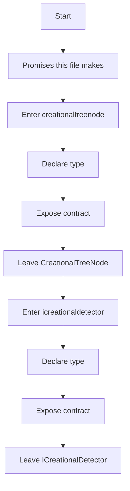
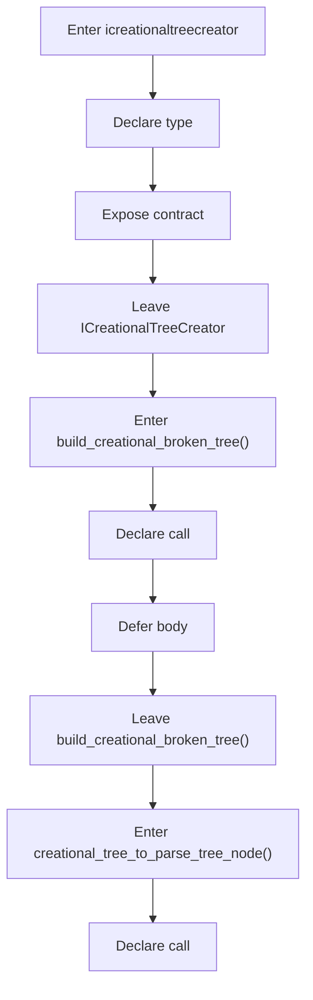
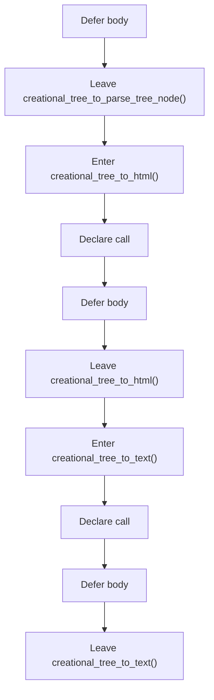

# creational_broken_tree_program_flow.hpp

- Source document: [creational_broken_tree.hpp.md](../creational_broken_tree.hpp.md)
- Purpose: decoupled implementation logic for a future code unit.

This diagram follows the action path in plain words. Decision diamonds show where the file can stop, branch, or repeat work instead of simply passing through a straight line.

### Block 1 - Program Flow Details
#### Part 1

#### Part 2

#### Part 3

#### Part 4

