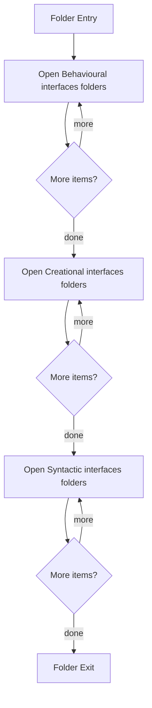

# Header

- Folder: docs/Codebase/Microservice/Modules/Header
- Descendant source docs: 37
- Generated on: 2026-04-23

## Logic Summary
Header contracts grouped by subsystem.

## Subsystem Story
This folder mainly acts as a navigation layer. Use it to understand how the deeper child folders divide the subsystem into smaller concerns.

## Folder Flow

## Child Folders By Logic
### Behavioural Interfaces
These child folders continue the subsystem by covering Behavioural detection interface layer..
- Behavioural/ : Behavioural detection interface layer.

### Creational Interfaces
These child folders continue the subsystem by covering Creational detection and transform interface layer..
- Creational/ : Creational detection and transform interface layer.

### Syntactic Interfaces
These child folders continue the subsystem by covering Generic parser and analysis interfaces shared across the microservice..
- SyntacticBrokenAST/ : Generic parser and analysis interfaces shared across the microservice.

## Reading Hint
- Use the child folder groups to navigate deeper into this subsystem.

