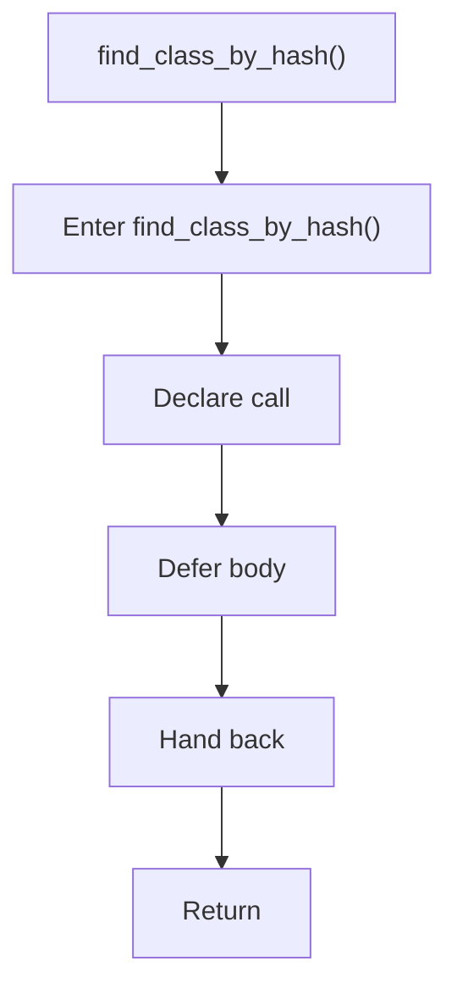

# find_class_by_hash.hpp

- Source document: [parse_tree_symbols.hpp.md](../../parse_tree_symbols.hpp.md)
- Purpose: decoupled implementation logic for a future code unit.

### find_class_by_hash()
This declaration exposes a callable contract without providing the runtime body here. It appears near line 76.

Inside the body, it mainly handles declare a callable contract and let implementation files define the runtime body.

What it does:
- declare a callable contract
- let implementation files define the runtime body

Flow:

