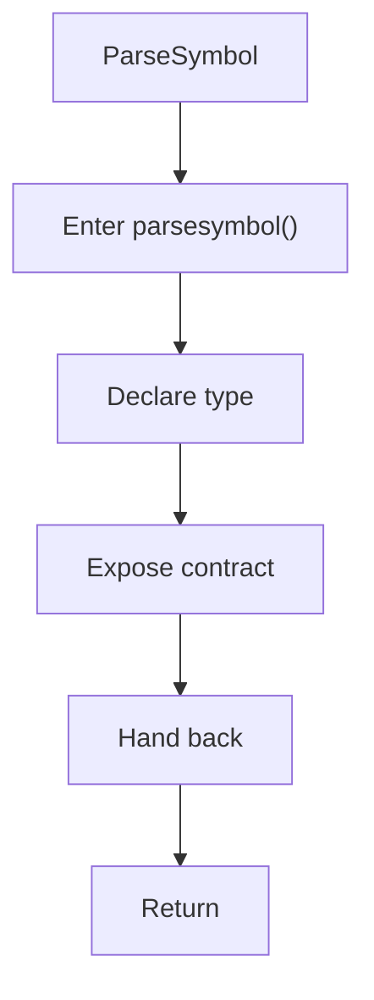

# parsesymbol.hpp

- Source document: [parse_tree_symbols.hpp.md](../../parse_tree_symbols.hpp.md)
- Purpose: decoupled implementation logic for a future code unit.

### ParseSymbol
This declaration introduces a shared type that other files compile against. It appears near line 10.

Inside the body, it mainly handles declare a shared type and expose the compile-time contract.

What it does:
- declare a shared type
- expose the compile-time contract

Flow:

