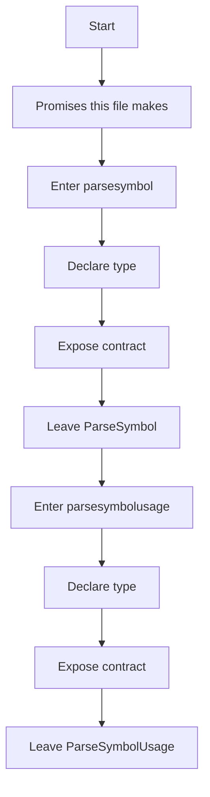
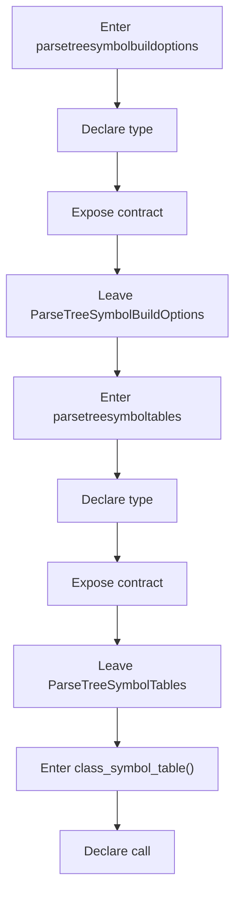
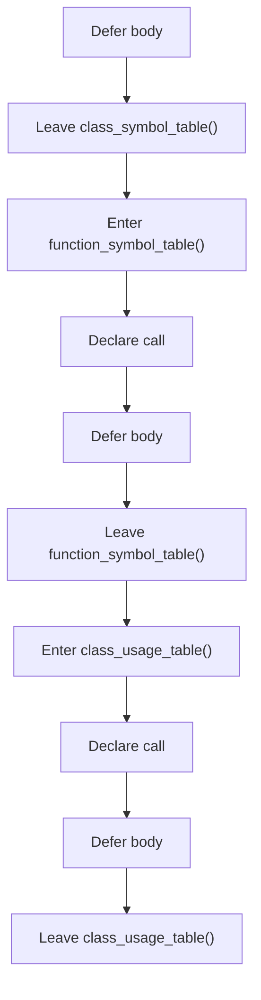
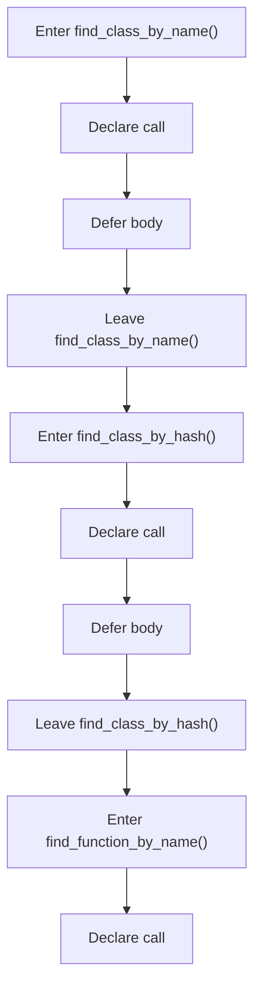
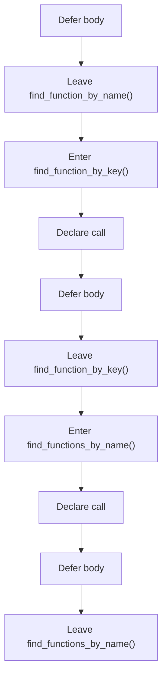
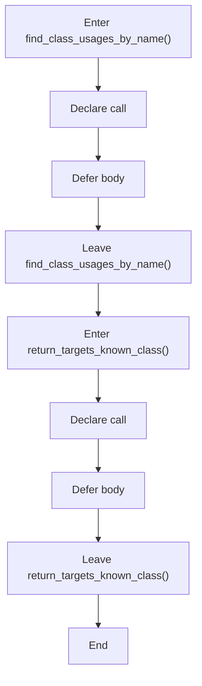

# parse_tree_symbols_program_flow.hpp

- Source document: [parse_tree_symbols.hpp.md](../parse_tree_symbols.hpp.md)
- Purpose: decoupled implementation logic for a future code unit.

This diagram follows the action path in plain words. Decision diamonds show where the file can stop, branch, or repeat work instead of simply passing through a straight line.

The flow is intentionally split into smaller slices so the major intent of parse_tree_symbols_program_flow.hpp stays readable. Each slice names the stage it is covering, gives a quick summary, and explains why that stage is separated from the next one.

### Program Flow Slices
#### Slice 1 - Opening Intent
Quick summary: This slice shows the opening intent of parse_tree_symbols_program_flow.hpp and the first major actions that frame the rest of the flow.
Why this is separate: parse_tree_symbols_program_flow.hpp has multiple branches, loops, or stage changes, so this section is split out to keep one major intent visible at a time instead of forcing one oversized diagram.

#### Slice 2 - Early Branches
Quick summary: This slice covers the first branch-heavy continuation of parse_tree_symbols_program_flow.hpp after the opening path has been established.
Why this is separate: parse_tree_symbols_program_flow.hpp has multiple branches, loops, or stage changes, so this section is split out to keep one major intent visible at a time instead of forcing one oversized diagram.

#### Slice 3 - Mid-Flow Handoff
Quick summary: This slice captures the mid-flow handoff in parse_tree_symbols_program_flow.hpp where preparation turns into deeper processing.
Why this is separate: parse_tree_symbols_program_flow.hpp has multiple branches, loops, or stage changes, so this section is split out to keep one major intent visible at a time instead of forcing one oversized diagram.

#### Slice 4 - Secondary Decision Path
Quick summary: This slice focuses on the next decision path in parse_tree_symbols_program_flow.hpp and the outcomes that follow from it.
Why this is separate: parse_tree_symbols_program_flow.hpp has multiple branches, loops, or stage changes, so this section is split out to keep one major intent visible at a time instead of forcing one oversized diagram.

#### Slice 5 - Follow-Through Stage
Quick summary: This slice follows the next working stage of parse_tree_symbols_program_flow.hpp after the earlier decisions have narrowed the path.
Why this is separate: parse_tree_symbols_program_flow.hpp has multiple branches, loops, or stage changes, so this section is split out to keep one major intent visible at a time instead of forcing one oversized diagram.

#### Slice 6 - Late-Stage Checks
Quick summary: This slice highlights later checks and continuation steps in parse_tree_symbols_program_flow.hpp before the run approaches its end.
Why this is separate: parse_tree_symbols_program_flow.hpp has multiple branches, loops, or stage changes, so this section is split out to keep one major intent visible at a time instead of forcing one oversized diagram.

