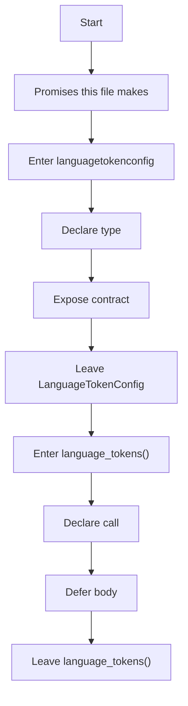
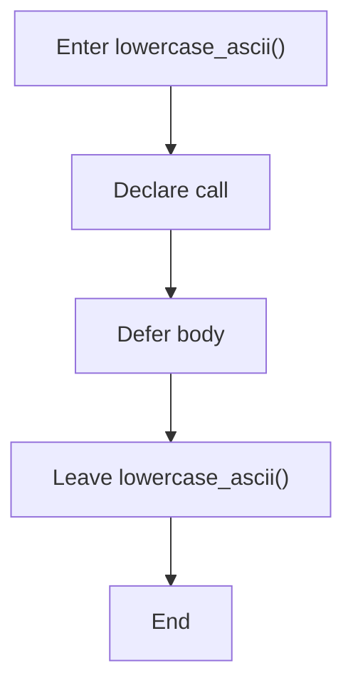
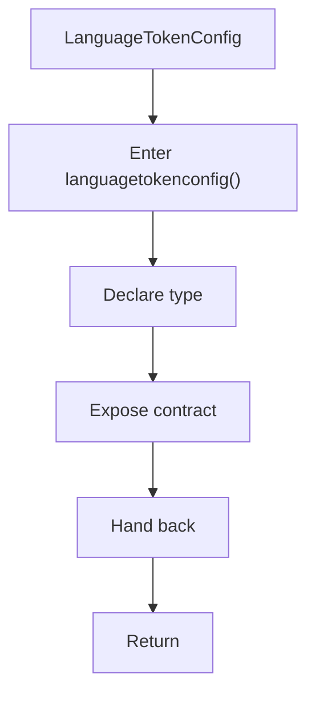
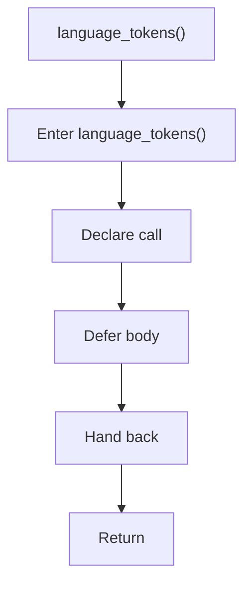
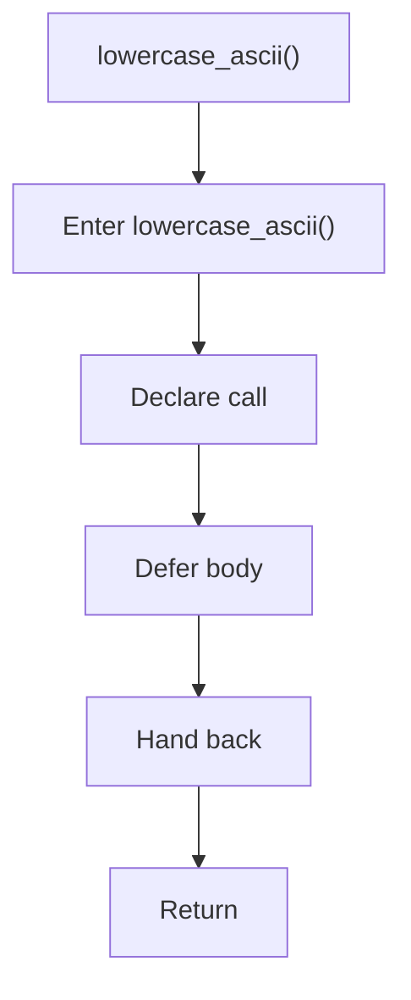

# language_tokens.hpp

- Source: Microservice/Modules/Header/SyntacticBrokenAST/Language-and-Structure/language_tokens.hpp
- Kind: C++ header
- Lines: 49

## Story
### What Happens Here

This header implements the compile-time contract for the generic parse and analysis pipeline. It is included before runtime execution begins so the C++ sources can agree on the shared data structures and function signatures.

### Why It Matters In The Flow

This artifact participates in the repository flow according to the surrounding module or toolchain that loads it.

### What To Watch While Reading

Declares the public interfaces and shared data types for the generic parse and analysis pipeline. The main surface area is easiest to track through symbols such as LanguageTokenConfig, language_tokens, and lowercase_ascii. It collaborates directly with string and unordered_set.

## Program Flow
This diagram follows the action path in plain words. Decision diamonds show where the file can stop, branch, or repeat work instead of simply passing through a straight line.

The flow is intentionally split into smaller slices so the major intent of language_tokens.hpp stays readable. Each slice names the stage it is covering, gives a quick summary, and explains why that stage is separated from the next one.

### Program Flow Slices
#### Slice 1 - Opening Intent
Quick summary: This slice shows the opening intent of language_tokens.hpp and the first major actions that frame the rest of the flow.
Why this is separate: language_tokens.hpp has multiple branches, loops, or stage changes, so this section is split out to keep one major intent visible at a time instead of forcing one oversized diagram.

#### Slice 2 - Early Branches
Quick summary: This slice covers the first branch-heavy continuation of language_tokens.hpp after the opening path has been established.
Why this is separate: language_tokens.hpp has multiple branches, loops, or stage changes, so this section is split out to keep one major intent visible at a time instead of forcing one oversized diagram.

## Reading Map
Read this file as: Declares the public interfaces and shared data types for the generic parse and analysis pipeline.

Where it sits in the run: This artifact participates in the repository flow according to the surrounding module or toolchain that loads it.

Names worth recognizing while reading: LanguageTokenConfig, language_tokens, and lowercase_ascii.

It leans on nearby contracts or tools such as string and unordered_set.

## Story Groups

### Promises This File Makes
These entries tell the rest of the program what this file can provide.
- LanguageTokenConfig (line 11): Declare a shared type and expose the compile-time contract
- language_tokens() (line 44): Declare a callable contract and let implementation files define the runtime body
- lowercase_ascii() (line 46): Declare a callable contract and let implementation files define the runtime body

## Function Stories

### LanguageTokenConfig
This declaration introduces a shared type that other files compile against. It appears near line 11.

Inside the body, it mainly handles declare a shared type and expose the compile-time contract.

What it does:
- declare a shared type
- expose the compile-time contract

Flow:

### language_tokens()
This declaration exposes a callable contract without providing the runtime body here. It appears near line 44.

Inside the body, it mainly handles declare a callable contract and let implementation files define the runtime body.

What it does:
- declare a callable contract
- let implementation files define the runtime body

Flow:

### lowercase_ascii()
This declaration exposes a callable contract without providing the runtime body here. It appears near line 46.

Inside the body, it mainly handles declare a callable contract and let implementation files define the runtime body.

What it does:
- declare a callable contract
- let implementation files define the runtime body

Flow:

## Documentation Note
- This markdown file is part of the generated docs/Codebase mirror.
- It was generated from the repository state on 2026-04-23 after reading the existing docs corpus and the current source tree.

