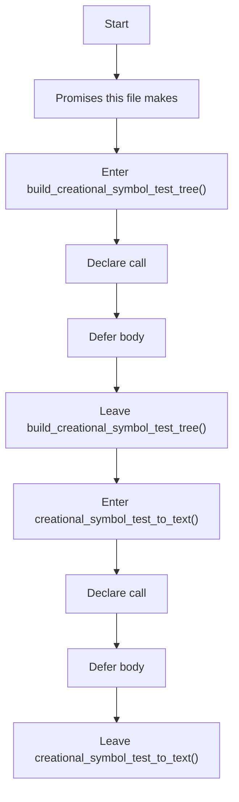
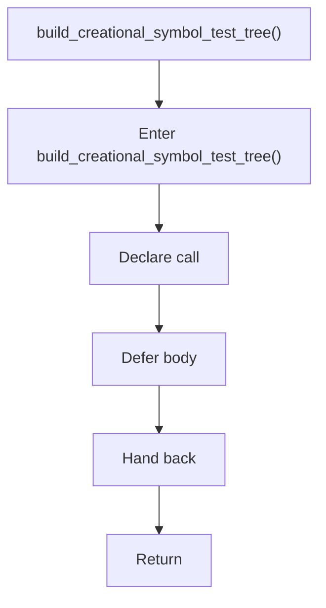
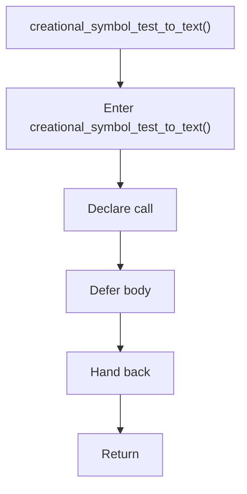

# creational_symbol_test.hpp

- Source: Microservice/Modules/Header/Creational/creational_symbol_test.hpp
- Kind: C++ header
- Lines: 19

## Story
### What Happens Here

This header implements the compile-time contract for the creational subsystem. It declares the detectors, transforms, and helper types that the runtime sources later define.

### Why It Matters In The Flow

This artifact participates in the repository flow according to the surrounding module or toolchain that loads it.

### What To Watch While Reading

Declares creational-pattern detection and transform interfaces. The main surface area is easiest to track through symbols such as build_creational_symbol_test_tree and creational_symbol_test_to_text. It collaborates directly with parse_tree.hpp and string.

## Program Flow
This diagram follows the action path in plain words. Decision diamonds show where the file can stop, branch, or repeat work instead of simply passing through a straight line.

The flow is intentionally split into smaller slices so the major intent of creational_symbol_test.hpp stays readable. Each slice names the stage it is covering, gives a quick summary, and explains why that stage is separated from the next one.

### Program Flow Slices
#### Slice 1 - Opening Intent
Quick summary: This slice shows the opening intent of creational_symbol_test.hpp and the first major actions that frame the rest of the flow.
Why this is separate: creational_symbol_test.hpp has multiple branches, loops, or stage changes, so this section is split out to keep one major intent visible at a time instead of forcing one oversized diagram.

#### Slice 2 - Early Branches
Quick summary: This slice covers the first branch-heavy continuation of creational_symbol_test.hpp after the opening path has been established.
Why this is separate: creational_symbol_test.hpp has multiple branches, loops, or stage changes, so this section is split out to keep one major intent visible at a time instead of forcing one oversized diagram.

## Reading Map
Read this file as: Declares creational-pattern detection and transform interfaces.

Where it sits in the run: This artifact participates in the repository flow according to the surrounding module or toolchain that loads it.

Names worth recognizing while reading: build_creational_symbol_test_tree and creational_symbol_test_to_text.

It leans on nearby contracts or tools such as parse_tree.hpp and string.

## Story Groups

### Promises This File Makes
These entries tell the rest of the program what this file can provide.
- build_creational_symbol_test_tree() (line 11): Declare a callable contract and let implementation files define the runtime body
- creational_symbol_test_to_text() (line 16): Declare a callable contract and let implementation files define the runtime body

## Function Stories

### build_creational_symbol_test_tree()
This declaration exposes a callable contract without providing the runtime body here. It appears near line 11.

Inside the body, it mainly handles declare a callable contract and let implementation files define the runtime body.

What it does:
- declare a callable contract
- let implementation files define the runtime body

Flow:

### creational_symbol_test_to_text()
This declaration exposes a callable contract without providing the runtime body here. It appears near line 16.

Inside the body, it mainly handles declare a callable contract and let implementation files define the runtime body.

What it does:
- declare a callable contract
- let implementation files define the runtime body

Flow:

## Documentation Note
- This markdown file is part of the generated docs/Codebase mirror.
- It was generated from the repository state on 2026-04-23 after reading the existing docs corpus and the current source tree.

