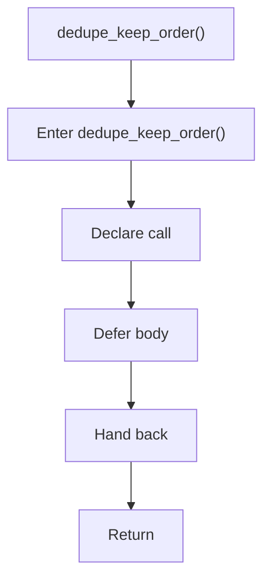

# dedupe_keep_order.hpp

- Source document: [parse_tree_hash_links_internal.hpp.md](../../parse_tree_hash_links_internal.hpp.md)
- Purpose: decoupled implementation logic for a future code unit.

### dedupe_keep_order()
This declaration exposes a callable contract without providing the runtime body here. It appears near line 44.

Inside the body, it mainly handles declare a callable contract and let implementation files define the runtime body.

What it does:
- declare a callable contract
- let implementation files define the runtime body

Flow:

