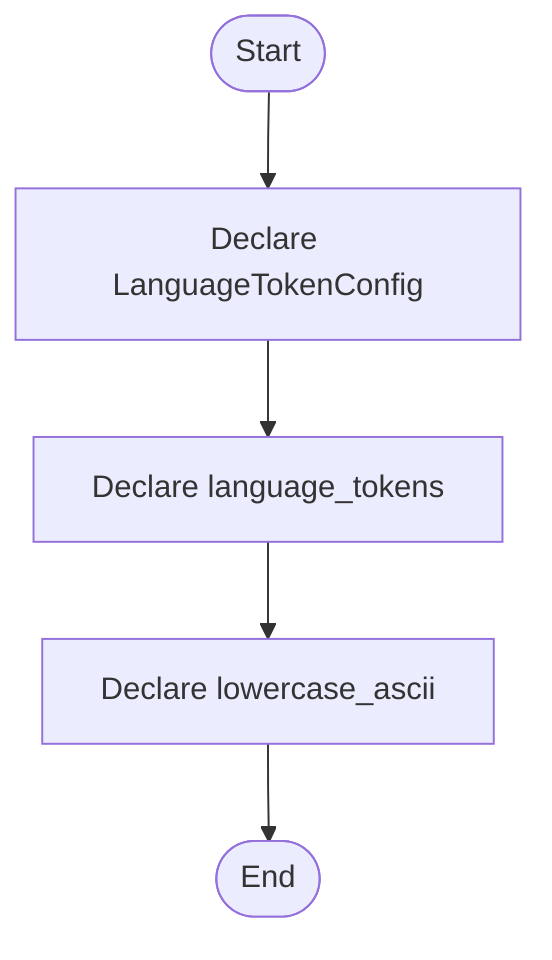

# language_tokens.hpp

- Source: Microservice/Modules/Header/SyntacticBrokenAST/Language-and-Structure/language_tokens.hpp
- Kind: C++ header
- Lines: 49
- Role: Declares the public interfaces and shared data types for the generic parse and analysis pipeline.
- Chronology: This artifact participates in the repository flow according to the surrounding module or toolchain that loads it.

## Notable Symbols
- LanguageTokenConfig
- language_tokens
- lowercase_ascii

## Direct Dependencies
- string
- unordered_set

## File Outline
### Responsibility

This header implements the compile-time contract for the generic parse and analysis pipeline. It is included before runtime execution begins so the C++ sources can agree on the shared data structures and function signatures.

### Position In The Flow

This artifact participates in the repository flow according to the surrounding module or toolchain that loads it.

### Main Surface Area

Declares the public interfaces and shared data types for the generic parse and analysis pipeline. The main surface area is easiest to track through symbols such as LanguageTokenConfig, language_tokens, and lowercase_ascii. It collaborates directly with string and unordered_set.

## File Activity


## Function Walkthrough

### LanguageTokenConfig
This declaration introduces a shared type that other files compile against. It appears near line 11.

Inside the body, it mainly handles declare a shared type and expose the compile-time contract.

Key operations:
- declare a shared type
- expose the compile-time contract

Activity:
```mermaid
flowchart TD
    Start([LanguageTokenConfig()])
    N0[Enter LanguageTokenConfig()]
    N1[Declare a shared type]
    N2[Expose the compile-time contract]
    N3[Hand control back to the caller]
    End([Return])
    Start --> N0
    N0 --> N1
    N1 --> N2
    N2 --> N3
    N3 --> End
```

### language_tokens
This declaration exposes a callable contract without providing the runtime body here. It appears near line 44.

Inside the body, it mainly handles declare a callable contract and let implementation files define the runtime body.

Key operations:
- declare a callable contract
- let implementation files define the runtime body

Activity:
```mermaid
flowchart TD
    Start([language_tokens()])
    N0[Enter language_tokens()]
    N1[Declare a callable contract]
    N2[Let implementation files define the runtime body]
    N3[Hand control back to the caller]
    End([Return])
    Start --> N0
    N0 --> N1
    N1 --> N2
    N2 --> N3
    N3 --> End
```

### lowercase_ascii
This declaration exposes a callable contract without providing the runtime body here. It appears near line 46.

Inside the body, it mainly handles declare a callable contract and let implementation files define the runtime body.

Key operations:
- declare a callable contract
- let implementation files define the runtime body

Activity:
```mermaid
flowchart TD
    Start([lowercase_ascii()])
    N0[Enter lowercase_ascii()]
    N1[Declare a callable contract]
    N2[Let implementation files define the runtime body]
    N3[Hand control back to the caller]
    End([Return])
    Start --> N0
    N0 --> N1
    N1 --> N2
    N2 --> N3
    N3 --> End
```

## Documentation Note
- This markdown file is part of the generated docs/Codebase mirror.
- It was generated from the repository state on 2026-04-23 after reading the existing docs corpus and the current source tree.

