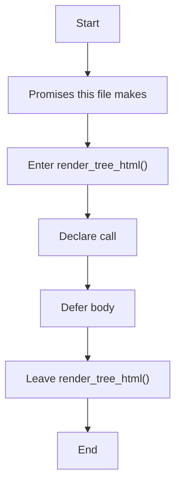
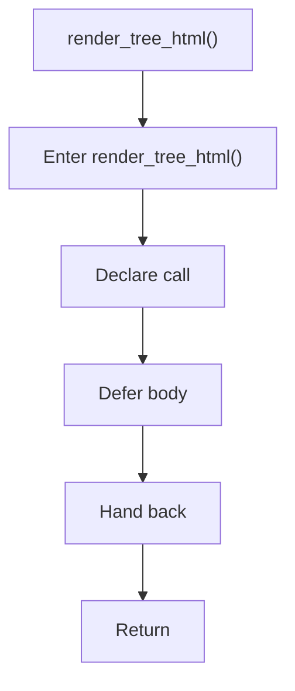

# tree_html_renderer.hpp

- Source: Microservice/Modules/Header/SyntacticBrokenAST/Output-and-Rendering/tree_html_renderer.hpp
- Kind: C++ header
- Lines: 17

## Story
### What Happens Here

This header implements the compile-time contract for the generic parse and analysis pipeline. It is included before runtime execution begins so the C++ sources can agree on the shared data structures and function signatures.

### Why It Matters In The Flow

This artifact participates in the repository flow according to the surrounding module or toolchain that loads it.

### What To Watch While Reading

Declares the public interfaces and shared data types for the generic parse and analysis pipeline. The main surface area is easiest to track through symbols such as render_tree_html. It collaborates directly with parse_tree.hpp and string.

## Program Flow
This diagram follows the action path in plain words. Decision diamonds show where the file can stop, branch, or repeat work instead of simply passing through a straight line.

## Reading Map
Read this file as: Declares the public interfaces and shared data types for the generic parse and analysis pipeline.

Where it sits in the run: This artifact participates in the repository flow according to the surrounding module or toolchain that loads it.

Names worth recognizing while reading: render_tree_html.

It leans on nearby contracts or tools such as parse_tree.hpp and string.

## Story Groups

### Promises This File Makes
These entries tell the rest of the program what this file can provide.
- render_tree_html() (line 11): Declare a callable contract and let implementation files define the runtime body

## Function Stories

### render_tree_html()
This declaration exposes a callable contract without providing the runtime body here. It appears near line 11.

Inside the body, it mainly handles declare a callable contract and let implementation files define the runtime body.

What it does:
- declare a callable contract
- let implementation files define the runtime body

Flow:

## Documentation Note
- This markdown file is part of the generated docs/Codebase mirror.
- It was generated from the repository state on 2026-04-23 after reading the existing docs corpus and the current source tree.

