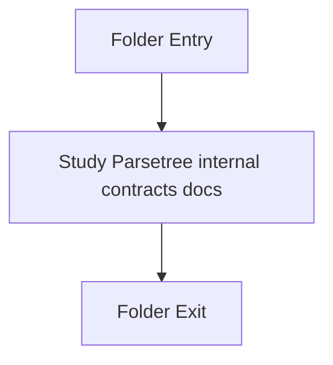

# Internal

- Folder: docs/Codebase/Microservice/Modules/Header/SyntacticBrokenAST/ParseTree/Internal
- Descendant source docs: 2
- Generated on: 2026-04-23

## Logic Summary
Private parse-tree implementation contracts used by the C++ sources.

## Subsystem Story
This folder is mostly leaf-level. The local documents here carry the main explanation of the subsystem without requiring much extra descent.

## Folder Flow

## Documents By Logic
### ParseTree Internal Contracts
These documents explain the local implementation by covering Declares the public interfaces and shared data types for the generic parse and analysis pipeline..
- parse_tree_hash_links_internal.hpp.md : Declares the public interfaces and shared data types for the generic parse and analysis pipeline.
- parse_tree_internal.hpp.md : Declares the public interfaces and shared data types for the generic parse and analysis pipeline.

## Reading Hint
- This folder is mostly leaf-level. Read the local file docs to understand the logic in this area.

