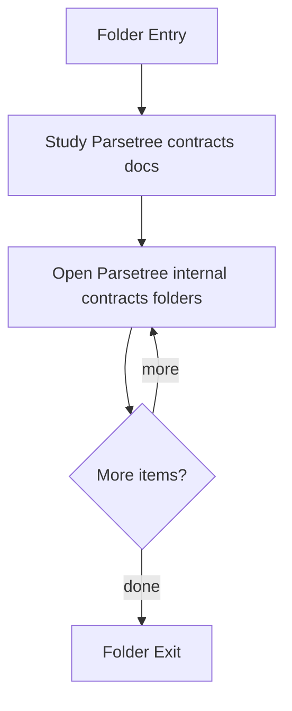

# ParseTree

- Folder: docs/Codebase/Microservice/Modules/Header/SyntacticBrokenAST/ParseTree
- Descendant source docs: 7
- Generated on: 2026-04-23

## Logic Summary
Public parse-tree contracts and helper interfaces.

## Subsystem Story
This folder mixes concrete local documents with deeper child subsystems. Read the local docs to understand the visible behavior first, then descend into the child folders for the lower-level detail that supports it.

## Folder Flow

## Child Folders By Logic
### ParseTree Internal Contracts
These child folders continue the subsystem by covering Private parse-tree implementation contracts used by the C++ sources..
- Internal/ : Private parse-tree implementation contracts used by the C++ sources.

## Documents By Logic
### ParseTree Contracts
These documents explain the local implementation by covering Declares the public interfaces and shared data types for the generic parse and analysis pipeline..
- parse_tree.hpp.md : Declares the public interfaces and shared data types for the generic parse and analysis pipeline.
- parse_tree_code_generator.hpp.md : Declares the public interfaces and shared data types for the generic parse and analysis pipeline.
- parse_tree_dependency_utils.hpp.md : Declares the public interfaces and shared data types for the generic parse and analysis pipeline.
- parse_tree_hash_links.hpp.md : Declares the public interfaces and shared data types for the generic parse and analysis pipeline.
- parse_tree_symbols.hpp.md : Declares the public interfaces and shared data types for the generic parse and analysis pipeline.

## Reading Hint
- Read the local file docs first for concrete behavior, then descend into the child folders for narrower subsystem details.

