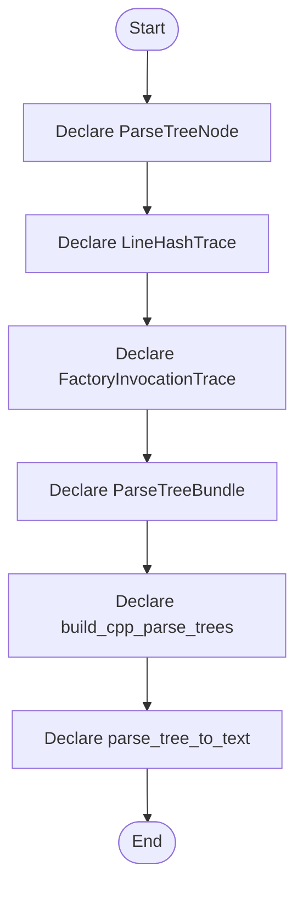

# parse_tree.hpp

- Source: Microservice/Modules/Header/SyntacticBrokenAST/ParseTree/parse_tree.hpp
- Kind: C++ header
- Lines: 82
- Role: Declares the public interfaces and shared data types for the generic parse and analysis pipeline.
- Chronology: This artifact participates in the repository flow according to the surrounding module or toolchain that loads it.

## Notable Symbols
- ParseTreeNode
- LineHashTrace
- FactoryInvocationTrace
- ParseTreeBundle
- build_cpp_parse_tree
- build_cpp_parse_trees
- parse_tree_to_text
- parse_tree_to_html

## Direct Dependencies
- Pipeline-Contracts/analysis_context.hpp
- Language-and-Structure/lexical_structure_hooks.hpp
- Input-and-CLI/source_reader.hpp
- cstddef
- string
- vector

## File Outline
### Responsibility

This header implements the compile-time contract for the generic parse and analysis pipeline. It is included before runtime execution begins so the C++ sources can agree on the shared data structures and function signatures.

### Position In The Flow

This artifact participates in the repository flow according to the surrounding module or toolchain that loads it.

### Main Surface Area

Declares the public interfaces and shared data types for the generic parse and analysis pipeline. The main surface area is easiest to track through symbols such as ParseTreeNode, LineHashTrace, FactoryInvocationTrace, and ParseTreeBundle. It collaborates directly with Pipeline-Contracts/analysis_context.hpp, Language-and-Structure/lexical_structure_hooks.hpp, Input-and-CLI/source_reader.hpp, and cstddef.

## File Activity


## Function Walkthrough

### ParseTreeNode
This declaration introduces a shared type that other files compile against. It appears near line 11.

Inside the body, it mainly handles declare a shared type and expose the compile-time contract.

Key operations:
- declare a shared type
- expose the compile-time contract

Activity:
```mermaid
flowchart TD
    Start([ParseTreeNode()])
    N0[Enter ParseTreeNode()]
    N1[Declare a shared type]
    N2[Expose the compile-time contract]
    N3[Hand control back to the caller]
    End([Return])
    Start --> N0
    N0 --> N1
    N1 --> N2
    N2 --> N3
    N3 --> End
```

### LineHashTrace
This declaration introduces a shared type that other files compile against. It appears near line 21.

Inside the body, it mainly handles declare a shared type and expose the compile-time contract.

Key operations:
- declare a shared type
- expose the compile-time contract

Activity:
```mermaid
flowchart TD
    Start([LineHashTrace()])
    N0[Enter LineHashTrace()]
    N1[Declare a shared type]
    N2[Expose the compile-time contract]
    N3[Hand control back to the caller]
    End([Return])
    Start --> N0
    N0 --> N1
    N1 --> N2
    N2 --> N3
    N3 --> End
```

### FactoryInvocationTrace
This declaration introduces a shared type that other files compile against. It appears near line 38.

Inside the body, it mainly handles declare a shared type and expose the compile-time contract.

Key operations:
- declare a shared type
- expose the compile-time contract

Activity:
```mermaid
flowchart TD
    Start([FactoryInvocationTrace()])
    N0[Enter FactoryInvocationTrace()]
    N1[Declare a shared type]
    N2[Expose the compile-time contract]
    N3[Hand control back to the caller]
    End([Return])
    Start --> N0
    N0 --> N1
    N1 --> N2
    N2 --> N3
    N3 --> End
```

### ParseTreeBundle
This declaration introduces a shared type that other files compile against. It appears near line 50.

Inside the body, it mainly handles declare a shared type and expose the compile-time contract.

Key operations:
- declare a shared type
- expose the compile-time contract

Activity:
```mermaid
flowchart TD
    Start([ParseTreeBundle()])
    N0[Enter ParseTreeBundle()]
    N1[Declare a shared type]
    N2[Expose the compile-time contract]
    N3[Hand control back to the caller]
    End([Return])
    Start --> N0
    N0 --> N1
    N1 --> N2
    N2 --> N3
    N3 --> End
```

### build_cpp_parse_trees
This declaration exposes a callable contract without providing the runtime body here. It appears near line 71.

Inside the body, it mainly handles declare a callable contract and let implementation files define the runtime body.

Key operations:
- declare a callable contract
- let implementation files define the runtime body

Activity:
```mermaid
flowchart TD
    Start([build_cpp_parse_trees()])
    N0[Enter build_cpp_parse_trees()]
    N1[Declare a callable contract]
    N2[Let implementation files define the runtime body]
    N3[Hand control back to the caller]
    End([Return])
    Start --> N0
    N0 --> N1
    N1 --> N2
    N2 --> N3
    N3 --> End
```

### parse_tree_to_text
This declaration exposes a callable contract without providing the runtime body here. It appears near line 78.

Inside the body, it mainly handles declare a callable contract and let implementation files define the runtime body.

Key operations:
- declare a callable contract
- let implementation files define the runtime body

Activity:
```mermaid
flowchart TD
    Start([parse_tree_to_text()])
    N0[Enter parse_tree_to_text()]
    N1[Declare a callable contract]
    N2[Let implementation files define the runtime body]
    N3[Hand control back to the caller]
    End([Return])
    Start --> N0
    N0 --> N1
    N1 --> N2
    N2 --> N3
    N3 --> End
```

### parse_tree_to_html
This declaration exposes a callable contract without providing the runtime body here. It appears near line 79.

Inside the body, it mainly handles declare a callable contract and let implementation files define the runtime body.

Key operations:
- declare a callable contract
- let implementation files define the runtime body

Activity:
```mermaid
flowchart TD
    Start([parse_tree_to_html()])
    N0[Enter parse_tree_to_html()]
    N1[Declare a callable contract]
    N2[Let implementation files define the runtime body]
    N3[Hand control back to the caller]
    End([Return])
    Start --> N0
    N0 --> N1
    N1 --> N2
    N2 --> N3
    N3 --> End
```

## Documentation Note
- This markdown file is part of the generated docs/Codebase mirror.
- It was generated from the repository state on 2026-04-23 after reading the existing docs corpus and the current source tree.

