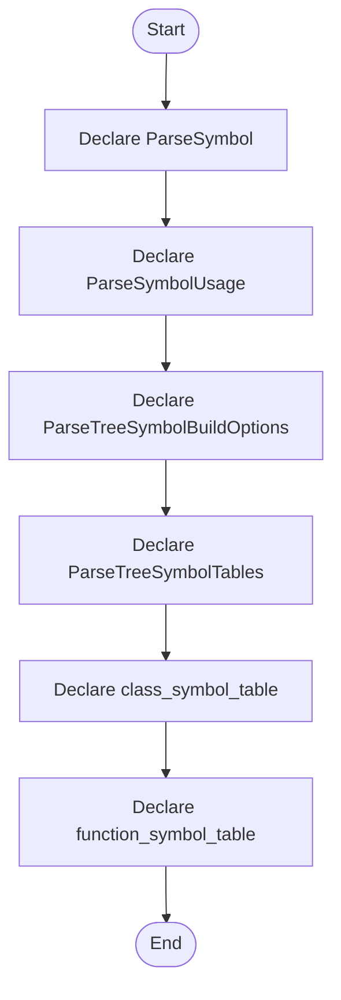

# parse_tree_symbols.hpp

- Source: Microservice/Modules/Header/SyntacticBrokenAST/ParseTree/parse_tree_symbols.hpp
- Kind: C++ header
- Lines: 96
- Role: Declares the public interfaces and shared data types for the generic parse and analysis pipeline.
- Chronology: This artifact participates in the repository flow according to the surrounding module or toolchain that loads it.

## Notable Symbols
- ParseSymbol
- ParseSymbolUsage
- ParseTreeSymbolBuildOptions
- ParseTreeSymbolTables
- build_parse_tree_symbol_tables
- class_symbol_table
- function_symbol_table
- class_usage_table
- find_class_by_name
- find_class_by_hash
- find_function_by_name
- find_function_by_key

## Direct Dependencies
- parse_tree.hpp
- cstddef
- string
- unordered_set
- vector

## File Outline
### Responsibility

This header implements the compile-time contract for the generic parse and analysis pipeline. It is included before runtime execution begins so the C++ sources can agree on the shared data structures and function signatures.

### Position In The Flow

This artifact participates in the repository flow according to the surrounding module or toolchain that loads it.

### Main Surface Area

Declares the public interfaces and shared data types for the generic parse and analysis pipeline. The main surface area is easiest to track through symbols such as ParseSymbol, ParseSymbolUsage, ParseTreeSymbolBuildOptions, and ParseTreeSymbolTables. It collaborates directly with parse_tree.hpp, cstddef, string, and unordered_set.

## File Activity


## Function Walkthrough

### ParseSymbol
This declaration introduces a shared type that other files compile against. It appears near line 10.

Inside the body, it mainly handles declare a shared type and expose the compile-time contract.

Key operations:
- declare a shared type
- expose the compile-time contract

Activity:
```mermaid
flowchart TD
    Start([ParseSymbol()])
    N0[Enter ParseSymbol()]
    N1[Declare a shared type]
    N2[Expose the compile-time contract]
    N3[Hand control back to the caller]
    End([Return])
    Start --> N0
    N0 --> N1
    N1 --> N2
    N2 --> N3
    N3 --> End
```

### ParseSymbolUsage
This declaration introduces a shared type that other files compile against. It appears near line 23.

Inside the body, it mainly handles declare a shared type and expose the compile-time contract.

Key operations:
- declare a shared type
- expose the compile-time contract

Activity:
```mermaid
flowchart TD
    Start([ParseSymbolUsage()])
    N0[Enter ParseSymbolUsage()]
    N1[Declare a shared type]
    N2[Expose the compile-time contract]
    N3[Hand control back to the caller]
    End([Return])
    Start --> N0
    N0 --> N1
    N1 --> N2
    N2 --> N3
    N3 --> End
```

### ParseTreeSymbolBuildOptions
This declaration introduces a shared type that other files compile against. It appears near line 37.

Inside the body, it mainly handles declare a shared type and expose the compile-time contract.

Key operations:
- declare a shared type
- expose the compile-time contract

Activity:
```mermaid
flowchart TD
    Start([ParseTreeSymbolBuildOptions()])
    N0[Enter ParseTreeSymbolBuildOptions()]
    N1[Declare a shared type]
    N2[Expose the compile-time contract]
    N3[Hand control back to the caller]
    End([Return])
    Start --> N0
    N0 --> N1
    N1 --> N2
    N2 --> N3
    N3 --> End
```

### ParseTreeSymbolTables
This declaration introduces a shared type that other files compile against. It appears near line 42.

Inside the body, it mainly handles declare a shared type and expose the compile-time contract.

Key operations:
- declare a shared type
- expose the compile-time contract

Activity:
```mermaid
flowchart TD
    Start([ParseTreeSymbolTables()])
    N0[Enter ParseTreeSymbolTables()]
    N1[Declare a shared type]
    N2[Expose the compile-time contract]
    N3[Hand control back to the caller]
    End([Return])
    Start --> N0
    N0 --> N1
    N1 --> N2
    N2 --> N3
    N3 --> End
```

### class_symbol_table
This declaration exposes a callable contract without providing the runtime body here. It appears near line 60.

Inside the body, it mainly handles declare a callable contract and let implementation files define the runtime body.

Key operations:
- declare a callable contract
- let implementation files define the runtime body

Activity:
```mermaid
flowchart TD
    Start([class_symbol_table()])
    N0[Enter class_symbol_table()]
    N1[Declare a callable contract]
    N2[Let implementation files define the runtime body]
    N3[Hand control back to the caller]
    End([Return])
    Start --> N0
    N0 --> N1
    N1 --> N2
    N2 --> N3
    N3 --> End
```

### function_symbol_table
This declaration exposes a callable contract without providing the runtime body here. It appears near line 65.

Inside the body, it mainly handles declare a callable contract and let implementation files define the runtime body.

Key operations:
- declare a callable contract
- let implementation files define the runtime body

Activity:
```mermaid
flowchart TD
    Start([function_symbol_table()])
    N0[Enter function_symbol_table()]
    N1[Declare a callable contract]
    N2[Let implementation files define the runtime body]
    N3[Hand control back to the caller]
    End([Return])
    Start --> N0
    N0 --> N1
    N1 --> N2
    N2 --> N3
    N3 --> End
```

### class_usage_table
This declaration exposes a callable contract without providing the runtime body here. It appears near line 70.

Inside the body, it mainly handles declare a callable contract and let implementation files define the runtime body.

Key operations:
- declare a callable contract
- let implementation files define the runtime body

Activity:
```mermaid
flowchart TD
    Start([class_usage_table()])
    N0[Enter class_usage_table()]
    N1[Declare a callable contract]
    N2[Let implementation files define the runtime body]
    N3[Hand control back to the caller]
    End([Return])
    Start --> N0
    N0 --> N1
    N1 --> N2
    N2 --> N3
    N3 --> End
```

### find_class_by_name
This declaration exposes a callable contract without providing the runtime body here. It appears near line 75.

Inside the body, it mainly handles declare a callable contract and let implementation files define the runtime body.

Key operations:
- declare a callable contract
- let implementation files define the runtime body

Activity:
```mermaid
flowchart TD
    Start([find_class_by_name()])
    N0[Enter find_class_by_name()]
    N1[Declare a callable contract]
    N2[Let implementation files define the runtime body]
    N3[Hand control back to the caller]
    End([Return])
    Start --> N0
    N0 --> N1
    N1 --> N2
    N2 --> N3
    N3 --> End
```

### find_class_by_hash
This declaration exposes a callable contract without providing the runtime body here. It appears near line 76.

Inside the body, it mainly handles declare a callable contract and let implementation files define the runtime body.

Key operations:
- declare a callable contract
- let implementation files define the runtime body

Activity:
```mermaid
flowchart TD
    Start([find_class_by_hash()])
    N0[Enter find_class_by_hash()]
    N1[Declare a callable contract]
    N2[Let implementation files define the runtime body]
    N3[Hand control back to the caller]
    End([Return])
    Start --> N0
    N0 --> N1
    N1 --> N2
    N2 --> N3
    N3 --> End
```

### find_function_by_name
This declaration exposes a callable contract without providing the runtime body here. It appears near line 81.

Inside the body, it mainly handles declare a callable contract and let implementation files define the runtime body.

Key operations:
- declare a callable contract
- let implementation files define the runtime body

Activity:
```mermaid
flowchart TD
    Start([find_function_by_name()])
    N0[Enter find_function_by_name()]
    N1[Declare a callable contract]
    N2[Let implementation files define the runtime body]
    N3[Hand control back to the caller]
    End([Return])
    Start --> N0
    N0 --> N1
    N1 --> N2
    N2 --> N3
    N3 --> End
```

### find_function_by_key
This declaration exposes a callable contract without providing the runtime body here. It appears near line 82.

Inside the body, it mainly handles declare a callable contract and let implementation files define the runtime body.

Key operations:
- declare a callable contract
- let implementation files define the runtime body

Activity:
```mermaid
flowchart TD
    Start([find_function_by_key()])
    N0[Enter find_function_by_key()]
    N1[Declare a callable contract]
    N2[Let implementation files define the runtime body]
    N3[Hand control back to the caller]
    End([Return])
    Start --> N0
    N0 --> N1
    N1 --> N2
    N2 --> N3
    N3 --> End
```

### find_functions_by_name
This declaration exposes a callable contract without providing the runtime body here. It appears near line 83.

Inside the body, it mainly handles declare a callable contract and let implementation files define the runtime body.

Key operations:
- declare a callable contract
- let implementation files define the runtime body

Activity:
```mermaid
flowchart TD
    Start([find_functions_by_name()])
    N0[Enter find_functions_by_name()]
    N1[Declare a callable contract]
    N2[Let implementation files define the runtime body]
    N3[Hand control back to the caller]
    End([Return])
    Start --> N0
    N0 --> N1
    N1 --> N2
    N2 --> N3
    N3 --> End
```

### find_class_usages_by_name
This declaration exposes a callable contract without providing the runtime body here. It appears near line 88.

Inside the body, it mainly handles declare a callable contract and let implementation files define the runtime body.

Key operations:
- declare a callable contract
- let implementation files define the runtime body

Activity:
```mermaid
flowchart TD
    Start([find_class_usages_by_name()])
    N0[Enter find_class_usages_by_name()]
    N1[Declare a callable contract]
    N2[Let implementation files define the runtime body]
    N3[Hand control back to the caller]
    End([Return])
    Start --> N0
    N0 --> N1
    N1 --> N2
    N2 --> N3
    N3 --> End
```

### return_targets_known_class
This declaration exposes a callable contract without providing the runtime body here. It appears near line 93.

Inside the body, it mainly handles declare a callable contract and let implementation files define the runtime body.

Key operations:
- declare a callable contract
- let implementation files define the runtime body

Activity:
```mermaid
flowchart TD
    Start([return_targets_known_class()])
    N0[Enter return_targets_known_class()]
    N1[Declare a callable contract]
    N2[Let implementation files define the runtime body]
    N3[Hand control back to the caller]
    End([Return])
    Start --> N0
    N0 --> N1
    N1 --> N2
    N2 --> N3
    N3 --> End
```

## Documentation Note
- This markdown file is part of the generated docs/Codebase mirror.
- It was generated from the repository state on 2026-04-23 after reading the existing docs corpus and the current source tree.

