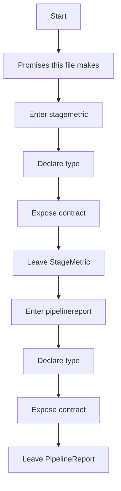
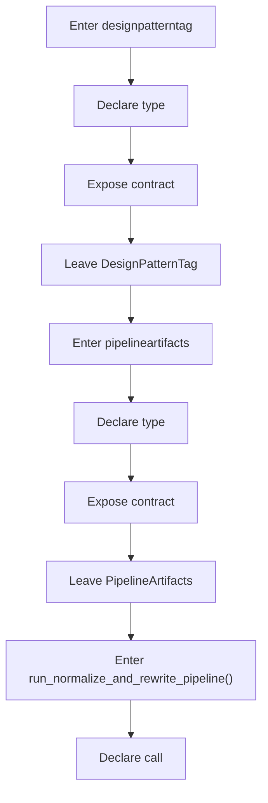
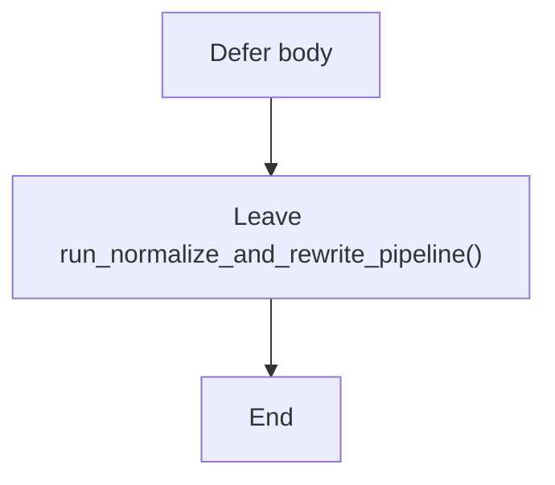
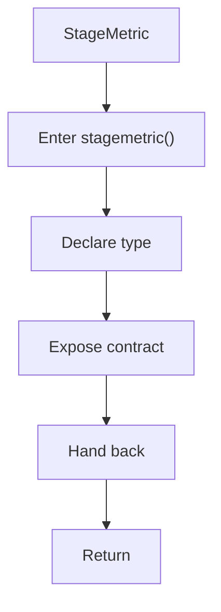
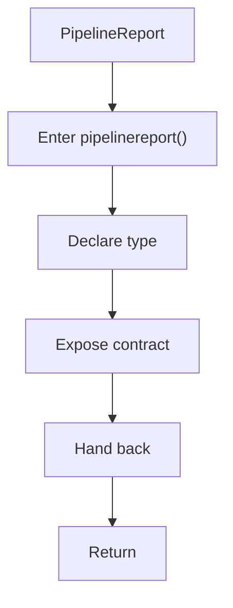
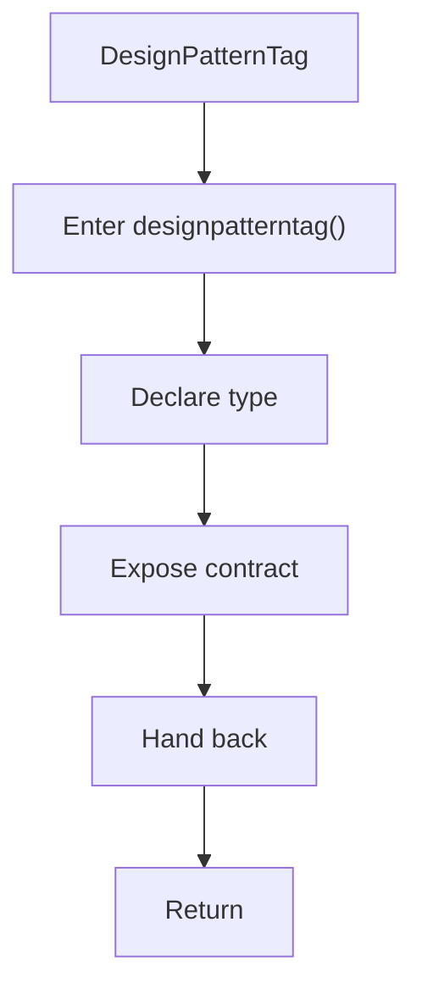
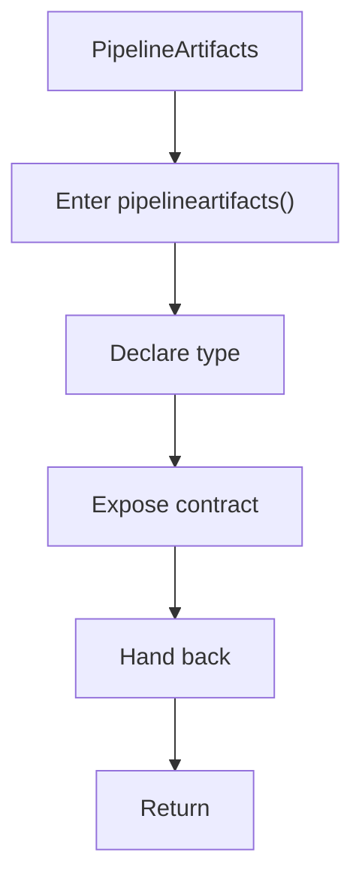
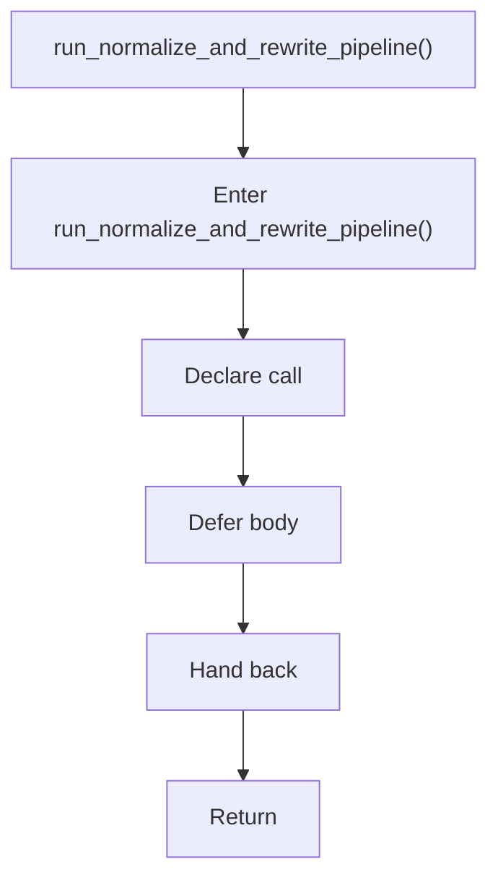

# algorithm_pipeline.hpp

- Source: Microservice/Modules/Header/SyntacticBrokenAST/Pipeline-Contracts/algorithm_pipeline.hpp
- Kind: C++ header
- Lines: 89

## Story
### What Happens Here

This header implements the compile-time contract for the generic parse and analysis pipeline. It is included before runtime execution begins so the C++ sources can agree on the shared data structures and function signatures.

### Why It Matters In The Flow

This artifact participates in the repository flow according to the surrounding module or toolchain that loads it.

### What To Watch While Reading

Declares the public interfaces and shared data types for the generic parse and analysis pipeline. The main surface area is easiest to track through symbols such as StageMetric, PipelineReport, DesignPatternTag, and PipelineArtifacts. It collaborates directly with behavioural_broken_tree.hpp, creational_broken_tree.hpp, parse_tree.hpp, and parse_tree_hash_links.hpp.

## Program Flow
This diagram follows the action path in plain words. Decision diamonds show where the file can stop, branch, or repeat work instead of simply passing through a straight line.

### Block 1 - Program Flow Details
#### Part 1

#### Part 2

#### Part 3

## Reading Map
Read this file as: Declares the public interfaces and shared data types for the generic parse and analysis pipeline.

Where it sits in the run: This artifact participates in the repository flow according to the surrounding module or toolchain that loads it.

Names worth recognizing while reading: StageMetric, PipelineReport, DesignPatternTag, PipelineArtifacts, run_normalize_and_rewrite_pipeline, and pipeline_report_to_json.

It leans on nearby contracts or tools such as behavioural_broken_tree.hpp, creational_broken_tree.hpp, parse_tree.hpp, parse_tree_hash_links.hpp, parse_tree_symbols.hpp, and Input-and-CLI/source_reader.hpp.

## Story Groups

### Promises This File Makes
These entries tell the rest of the program what this file can provide.
- StageMetric (line 14): Declare a shared type and expose the compile-time contract
- PipelineReport (line 21): Declare a shared type and expose the compile-time contract
- DesignPatternTag (line 42): Declare a shared type and expose the compile-time contract
- PipelineArtifacts (line 57): Declare a shared type and expose the compile-time contract
- run_normalize_and_rewrite_pipeline() (line 73): Declare a callable contract and let implementation files define the runtime body

## Function Stories

### StageMetric
This declaration introduces a shared type that other files compile against. It appears near line 14.

Inside the body, it mainly handles declare a shared type and expose the compile-time contract.

What it does:
- declare a shared type
- expose the compile-time contract

Flow:

### PipelineReport
This declaration introduces a shared type that other files compile against. It appears near line 21.

Inside the body, it mainly handles declare a shared type and expose the compile-time contract.

What it does:
- declare a shared type
- expose the compile-time contract

Flow:

### DesignPatternTag
This declaration introduces a shared type that other files compile against. It appears near line 42.

Inside the body, it mainly handles declare a shared type and expose the compile-time contract.

What it does:
- declare a shared type
- expose the compile-time contract

Flow:

### PipelineArtifacts
This declaration introduces a shared type that other files compile against. It appears near line 57.

Inside the body, it mainly handles declare a shared type and expose the compile-time contract.

What it does:
- declare a shared type
- expose the compile-time contract

Flow:

### run_normalize_and_rewrite_pipeline()
This declaration exposes a callable contract without providing the runtime body here. It appears near line 73.

Inside the body, it mainly handles declare a callable contract and let implementation files define the runtime body.

What it does:
- declare a callable contract
- let implementation files define the runtime body

Flow:

## Documentation Note
- This markdown file is part of the generated docs/Codebase mirror.
- It was generated from the repository state on 2026-04-23 after reading the existing docs corpus and the current source tree.
