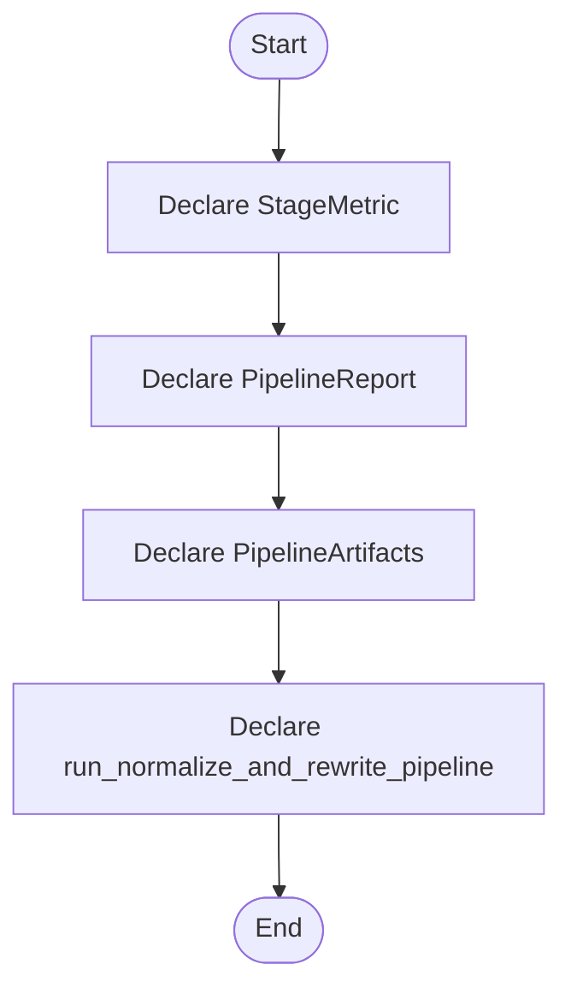

# algorithm_pipeline.hpp

- Source: Microservice/Modules/Header/SyntacticBrokenAST/Pipeline-Contracts/algorithm_pipeline.hpp
- Kind: C++ header
- Lines: 73
- Role: Declares the public interfaces and shared data types for the generic parse and analysis pipeline.
- Chronology: This artifact participates in the repository flow according to the surrounding module or toolchain that loads it.

## Notable Symbols
- StageMetric
- PipelineReport
- PipelineArtifacts
- run_normalize_and_rewrite_pipeline
- pipeline_report_to_json

## Direct Dependencies
- behavioural_broken_tree.hpp
- creational_broken_tree.hpp
- parse_tree.hpp
- parse_tree_code_generator.hpp
- parse_tree_hash_links.hpp
- parse_tree_symbols.hpp
- Input-and-CLI/source_reader.hpp
- cstddef
- string
- vector

## File Outline
### Responsibility

This header implements the compile-time contract for the generic parse and analysis pipeline. It is included before runtime execution begins so the C++ sources can agree on the shared data structures and function signatures.

### Position In The Flow

This artifact participates in the repository flow according to the surrounding module or toolchain that loads it.

### Main Surface Area

Declares the public interfaces and shared data types for the generic parse and analysis pipeline. The main surface area is easiest to track through symbols such as StageMetric, PipelineReport, PipelineArtifacts, and run_normalize_and_rewrite_pipeline. It collaborates directly with behavioural_broken_tree.hpp, creational_broken_tree.hpp, parse_tree.hpp, and parse_tree_code_generator.hpp.

## File Activity


## Function Walkthrough

### StageMetric
This declaration introduces a shared type that other files compile against. It appears near line 15.

Inside the body, it mainly handles declare a shared type and expose the compile-time contract.

Key operations:
- declare a shared type
- expose the compile-time contract

Activity:
```mermaid
flowchart TD
    Start([StageMetric()])
    N0[Enter StageMetric()]
    N1[Declare a shared type]
    N2[Expose the compile-time contract]
    N3[Hand control back to the caller]
    End([Return])
    Start --> N0
    N0 --> N1
    N1 --> N2
    N2 --> N3
    N3 --> End
```

### PipelineReport
This declaration introduces a shared type that other files compile against. It appears near line 22.

Inside the body, it mainly handles declare a shared type and expose the compile-time contract.

Key operations:
- declare a shared type
- expose the compile-time contract

Activity:
```mermaid
flowchart TD
    Start([PipelineReport()])
    N0[Enter PipelineReport()]
    N1[Declare a shared type]
    N2[Expose the compile-time contract]
    N3[Hand control back to the caller]
    End([Return])
    Start --> N0
    N0 --> N1
    N1 --> N2
    N2 --> N3
    N3 --> End
```

### PipelineArtifacts
This declaration introduces a shared type that other files compile against. It appears near line 42.

Inside the body, it mainly handles declare a shared type and expose the compile-time contract.

Key operations:
- declare a shared type
- expose the compile-time contract

Activity:
```mermaid
flowchart TD
    Start([PipelineArtifacts()])
    N0[Enter PipelineArtifacts()]
    N1[Declare a shared type]
    N2[Expose the compile-time contract]
    N3[Hand control back to the caller]
    End([Return])
    Start --> N0
    N0 --> N1
    N1 --> N2
    N2 --> N3
    N3 --> End
```

### run_normalize_and_rewrite_pipeline
This declaration exposes a callable contract without providing the runtime body here. It appears near line 57.

Inside the body, it mainly handles declare a callable contract and let implementation files define the runtime body.

Key operations:
- declare a callable contract
- let implementation files define the runtime body

Activity:
```mermaid
flowchart TD
    Start([run_normalize_and_rewrite_pipeline()])
    N0[Enter run_normalize_and_rewrite_pipeline()]
    N1[Declare a callable contract]
    N2[Let implementation files define the runtime body]
    N3[Hand control back to the caller]
    End([Return])
    Start --> N0
    N0 --> N1
    N1 --> N2
    N2 --> N3
    N3 --> End
```

## Documentation Note
- This markdown file is part of the generated docs/Codebase mirror.
- It was generated from the repository state on 2026-04-23 after reading the existing docs corpus and the current source tree.

