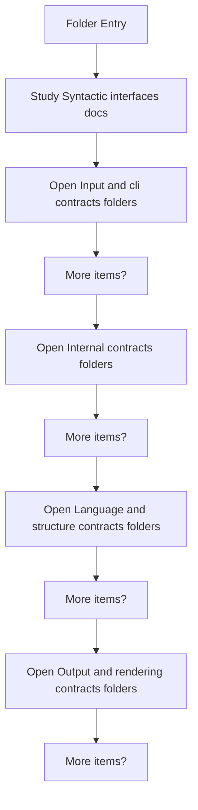
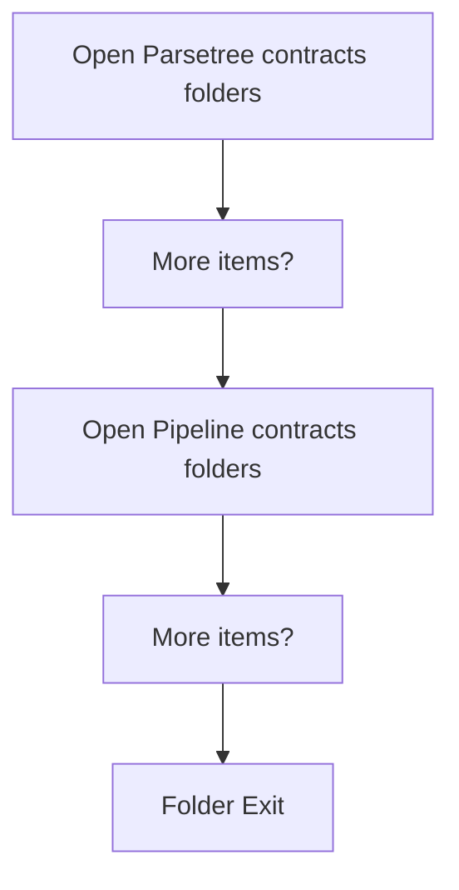

# SyntacticBrokenAST

- Folder: docs/Codebase/Microservice/Modules/Header/SyntacticBrokenAST
- Descendant source docs: 23
- Generated on: 2026-04-23

## Logic Summary
Generic parser and analysis interfaces shared across the microservice.

## Subsystem Story
This folder mixes concrete local documents with deeper child subsystems. Read the local docs to understand the visible behavior first, then descend into the child folders for the lower-level detail that supports it.

## Folder Flow

### Block 1 - Folder Flow Details
#### Part 1

#### Part 2

## Child Folders By Logic
### Input And CLI Contracts
These child folders continue the subsystem by covering Contracts that describe how source files enter the syntactic subsystem and how command input is represented..
- Input-and-CLI/ : Contracts that describe how source files enter the syntactic subsystem and how command input is represented.

### Internal Contracts
These child folders continue the subsystem by covering Internal header contracts supporting the syntactic subsystem..
- Internal/ : Internal header contracts supporting the syntactic subsystem.

### Language And Structure Contracts
These child folders continue the subsystem by covering Contracts for token vocabulary and structural keyword hooks used during parsing..
- Language-and-Structure/ : Contracts for token vocabulary and structural keyword hooks used during parsing.

### Output And Rendering Contracts
These child folders continue the subsystem by covering Contracts for output writing and visual rendering of generated syntactic artifacts..
- Output-and-Rendering/ : Contracts for output writing and visual rendering of generated syntactic artifacts.

### ParseTree Contracts
These child folders continue the subsystem by covering Public parse-tree contracts and helper interfaces..
- ParseTree/ : Public parse-tree contracts and helper interfaces.

### Pipeline Contracts
These child folders continue the subsystem by covering Pipeline-level contracts for reports, shared context, and orchestration-facing syntactic types..
- Pipeline-Contracts/ : Pipeline-level contracts for reports, shared context, and orchestration-facing syntactic types.

## Documents By Logic
### Syntactic Interfaces
These documents explain the local implementation by covering Declares the public interfaces and shared data types for the generic parse and analysis pipeline..
- parse_tree.hpp.md : Declares the public interfaces and shared data types for the generic parse and analysis pipeline.
- parse_tree_code_generator.hpp.md : Declares the public interfaces and shared data types for the generic parse and analysis pipeline.
- parse_tree_dependency_utils.hpp.md : Declares the public interfaces and shared data types for the generic parse and analysis pipeline.
- parse_tree_hash_links.hpp.md : Declares the public interfaces and shared data types for the generic parse and analysis pipeline.
- parse_tree_symbols.hpp.md : Declares the public interfaces and shared data types for the generic parse and analysis pipeline.

## Reading Hint
- Read the local file docs first for concrete behavior, then descend into the child folders for narrower subsystem details.
