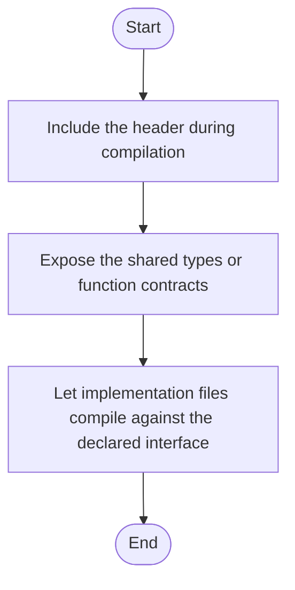

# parse_tree_symbols.hpp

- Source: Microservice/Modules/Header/SyntacticBrokenAST/parse_tree_symbols.hpp
- Kind: C++ header
- Lines: 6
- Role: Declares the public interfaces and shared data types for the generic parse and analysis pipeline.
- Chronology: This artifact participates in the repository flow according to the surrounding module or toolchain that loads it.

## Notable Symbols
- This artifact is primarily declarative or inline and does not expose many named symbols.

## Direct Dependencies
- ParseTree/parse_tree_symbols.hpp

## Implementation Story
This header implements the compile-time contract for the generic parse and analysis pipeline. It is included before runtime execution begins so the C++ sources can agree on the shared data structures and function signatures. Declares the public interfaces and shared data types for the generic parse and analysis pipeline. This artifact participates in the repository flow according to the surrounding module or toolchain that loads it. In practice it collaborates directly with ParseTree/parse_tree_symbols.hpp.

## Activity Diagram

## Documentation Note
- This markdown file is part of the generated docs/Codebase mirror.
- It was generated from the repository state on 2026-04-22 after reading the existing docs corpus and the current source tree.

