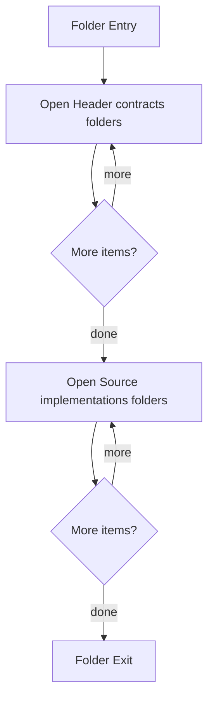

# Modules

- Folder: docs/Codebase/Microservice/Modules
- Descendant source docs: 92
- Generated on: 2026-04-23

## Logic Summary
Modularized C++ implementation divided into compile-time headers and source implementations.

## Subsystem Story
This folder mainly acts as a navigation layer. Use it to understand how the deeper child folders divide the subsystem into smaller concerns.

## Folder Flow

## Child Folders By Logic
### Header Contracts
These child folders continue the subsystem by covering Header contracts grouped by subsystem..
- Header/ : Header contracts grouped by subsystem.

### Source Implementations
These child folders continue the subsystem by covering C++ source implementations grouped by subsystem..
- Source/ : C++ source implementations grouped by subsystem.

## Reading Hint
- Use the child folder groups to navigate deeper into this subsystem.

