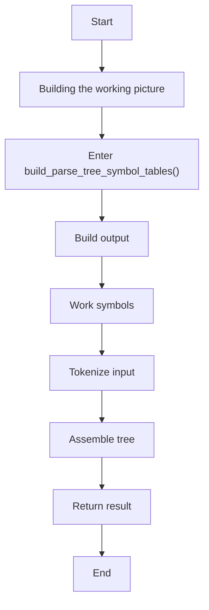
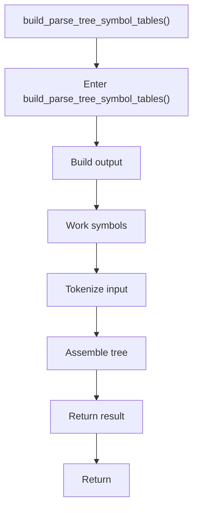

# symbols.cpp

- Source: Microservice/Modules/Source/ParseTree/symbols.cpp
- Kind: C++ implementation
- Lines: 11

## Story
### What Happens Here

This source file implements one internal part of the generic parse-tree engine. It contributes specialized behavior such as dependency handling, symbolization, hash-link construction, rendering, or older generation helpers after the raw tree exists. This source file implements one of the generic middle-stage services in the C++ pipeline. It is executed after sources are loaded and before the final report and rendered outputs are written.

### Why It Matters In The Flow

Runs across the middle of the microservice flow to build parse trees, hash links, symbol tables, documentation tags, reports, and rendered outputs.

### What To Watch While Reading

Implements parsing, shadow-tree building, symbolization, hash linking, rendering, and reporting. The main surface area is easiest to track through symbols such as build_parse_tree_symbol_tables and parse_tree_symbols_internal::build_symbol_tables_with_builder. It collaborates directly with parse_tree_symbols.hpp and Internal/parse_tree_symbols_internal.hpp.

## Program Flow
This diagram follows the action path in plain words. Decision diamonds show where the file can stop, branch, or repeat work instead of simply passing through a straight line.

## Reading Map
Read this file as: Implements parsing, shadow-tree building, symbolization, hash linking, rendering, and reporting.

Where it sits in the run: Runs across the middle of the microservice flow to build parse trees, hash links, symbol tables, documentation tags, reports, and rendered outputs.

Names worth recognizing while reading: build_parse_tree_symbol_tables and parse_tree_symbols_internal::build_symbol_tables_with_builder.

It leans on nearby contracts or tools such as parse_tree_symbols.hpp and Internal/parse_tree_symbols_internal.hpp.

## Story Groups

### Building The Working Picture
These steps assemble the trees, models, or bundles used by the rest of the file.
- build_parse_tree_symbol_tables() (line 4): Build or append the next output structure, work with symbol-oriented state, and parse or tokenize input text

## Function Stories

### build_parse_tree_symbol_tables()
This routine assembles a larger structure from the inputs it receives. It appears near line 4.

Inside the body, it mainly handles build or append the next output structure, work with symbol-oriented state, parse or tokenize input text, and assemble tree or artifact structures.

The caller receives a computed result or status from this step.

What it does:
- build or append the next output structure
- work with symbol-oriented state
- parse or tokenize input text
- assemble tree or artifact structures

Flow:

## Documentation Note
- This markdown file is part of the generated docs/Codebase mirror.
- It was generated from the repository state on 2026-04-23 after reading the existing docs corpus and the current source tree.

