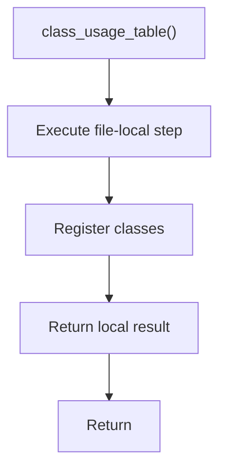

# class_usage_table.cpp

- Source document: [symbols_queries.cpp.md](../../symbols_queries.cpp.md)
- Purpose: decoupled implementation logic for a future code unit.

### class_usage_table()
This routine owns one focused piece of the file's behavior.

Inside the body, it mainly handles inspect or register class-level information.

The caller receives a computed result or status from this step.

What it does:
- inspect or register class-level information

Flow:

