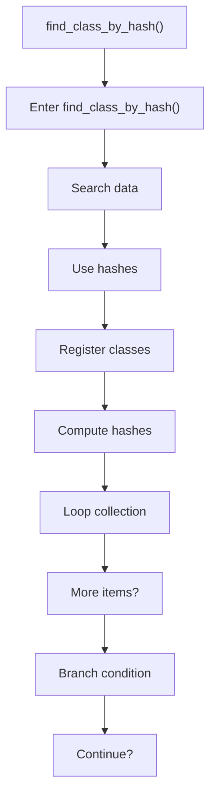
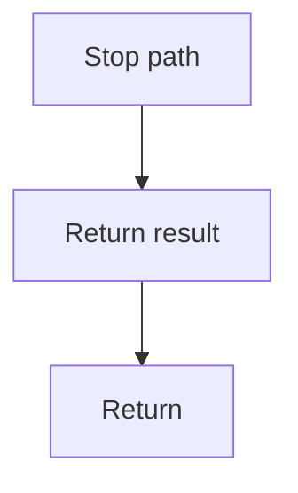

# find_class_by_hash.cpp

- Source document: [symbols_queries.cpp.md](../../symbols_queries.cpp.md)
- Purpose: decoupled implementation logic for a future code unit.

### find_class_by_hash()
This routine owns one focused piece of the file's behavior. It appears near line 32.

Inside the body, it mainly handles search previously collected data, compute or reuse hash-oriented identifiers, inspect or register class-level information, and compute hash metadata.

The implementation iterates over a collection or repeated workload. It branches on runtime conditions instead of following one fixed path. The caller receives a computed result or status from this step.

What it does:
- search previously collected data
- compute or reuse hash-oriented identifiers
- inspect or register class-level information
- compute hash metadata
- iterate over the active collection
- branch on runtime conditions

Flow:

### Block 3 - find_class_by_hash() Details
#### Slice 1 - Opening Intent
Quick summary: This slice shows the opening intent of find_class_by_hash.cpp and the first major actions that frame the rest of the flow.
Why this is separate: find_class_by_hash.cpp has multiple branches, loops, or stage changes, so this section is split out to keep one major intent visible at a time instead of forcing one oversized diagram.

#### Slice 2 - Early Branches
Quick summary: This slice covers the first branch-heavy continuation of find_class_by_hash.cpp after the opening path has been established.
Why this is separate: find_class_by_hash.cpp has multiple branches, loops, or stage changes, so this section is split out to keep one major intent visible at a time instead of forcing one oversized diagram.

