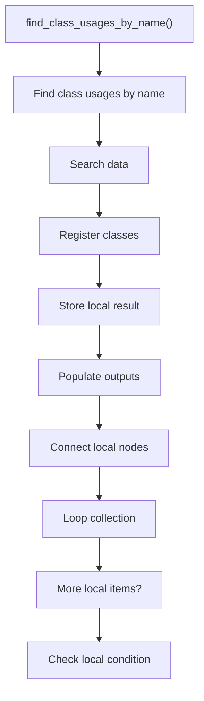
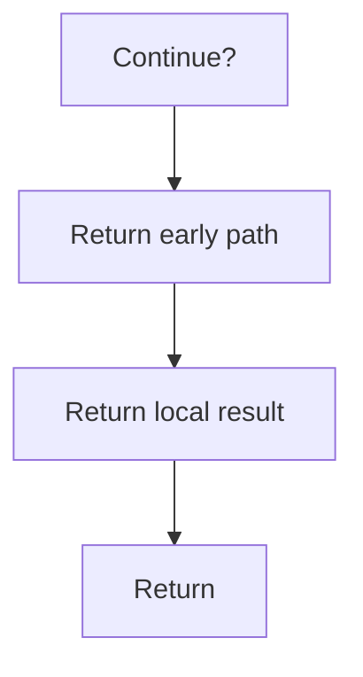

# find_class_usages_by_name.cpp

- Source document: [symbols_queries.cpp.md](../../symbols_queries.cpp.md)
- Purpose: decoupled implementation logic for a future code unit.

### find_class_usages_by_name()
This routine owns one focused piece of the file's behavior.

Inside the body, it mainly handles search previously collected data, inspect or register class-level information, store local findings, and fill local output fields.

The implementation iterates over a collection or repeated workload. It branches on runtime conditions instead of following one fixed path. The caller receives a computed result or status from this step.

What it does:
- search previously collected data
- inspect or register class-level information
- store local findings
- fill local output fields
- connect local structures
- walk the local collection
- branch on local conditions

Flow:

### Block 5 - find_class_usages_by_name() Details
#### Slice 1 - Establish Local Entry
Quick summary: This slice shows the first file-local stage for find_class_usages_by_name.cpp and keeps the diagram scoped to this code unit.
Why this is separate: find_class_usages_by_name.cpp has multiple branches, loops, or stage changes, so this section is split out to keep one major intent visible at a time instead of forcing one oversized diagram.

#### Slice 2 - Handle Early Decisions
Quick summary: This slice shows the first local decision path for find_class_usages_by_name.cpp after setup.
Why this is separate: find_class_usages_by_name.cpp has multiple branches, loops, or stage changes, so this section is split out to keep one major intent visible at a time instead of forcing one oversized diagram.

