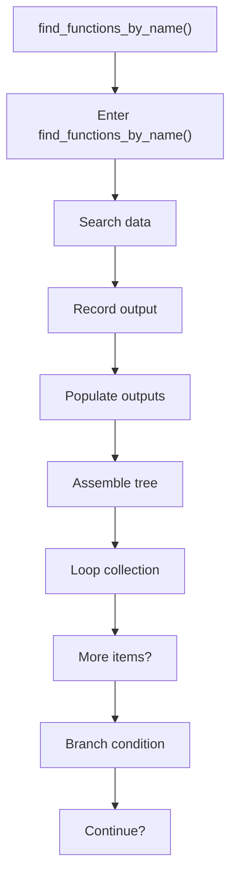
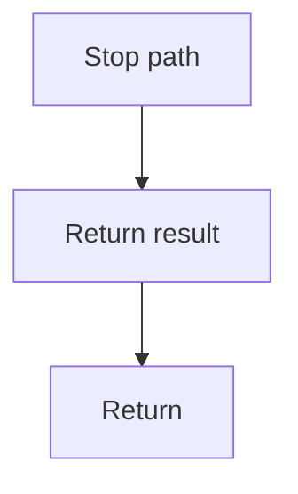

# find_functions_by_name.cpp

- Source document: [symbols_queries.cpp.md](../../symbols_queries.cpp.md)
- Purpose: decoupled implementation logic for a future code unit.

### find_functions_by_name()
This routine owns one focused piece of the file's behavior. It appears near line 68.

Inside the body, it mainly handles search previously collected data, record derived output into collections, populate output fields or accumulators, and assemble tree or artifact structures.

The implementation iterates over a collection or repeated workload. It branches on runtime conditions instead of following one fixed path. The caller receives a computed result or status from this step.

What it does:
- search previously collected data
- record derived output into collections
- populate output fields or accumulators
- assemble tree or artifact structures
- iterate over the active collection
- branch on runtime conditions

Flow:

### Block 4 - find_functions_by_name() Details
#### Slice 1 - Opening Intent
Quick summary: This slice shows the opening intent of find_functions_by_name.cpp and the first major actions that frame the rest of the flow.
Why this is separate: find_functions_by_name.cpp has multiple branches, loops, or stage changes, so this section is split out to keep one major intent visible at a time instead of forcing one oversized diagram.

#### Slice 2 - Early Branches
Quick summary: This slice covers the first branch-heavy continuation of find_functions_by_name.cpp after the opening path has been established.
Why this is separate: find_functions_by_name.cpp has multiple branches, loops, or stage changes, so this section is split out to keep one major intent visible at a time instead of forcing one oversized diagram.

