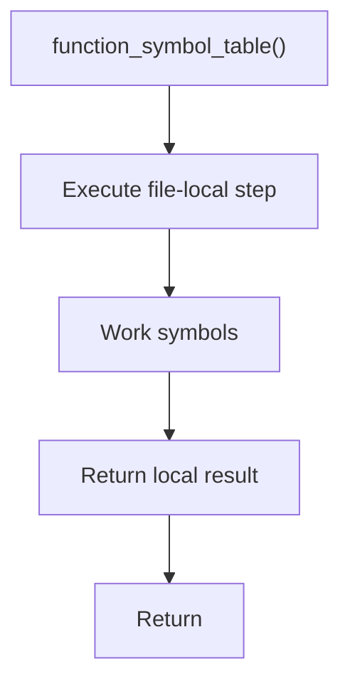

# function_symbol_table.cpp

- Source document: [symbols_queries.cpp.md](../../symbols_queries.cpp.md)
- Purpose: decoupled implementation logic for a future code unit.

### function_symbol_table()
This routine owns one focused piece of the file's behavior.

Inside the body, it mainly handles work with symbol-oriented state.

The caller receives a computed result or status from this step.

What it does:
- work with symbol-oriented state

Flow:

