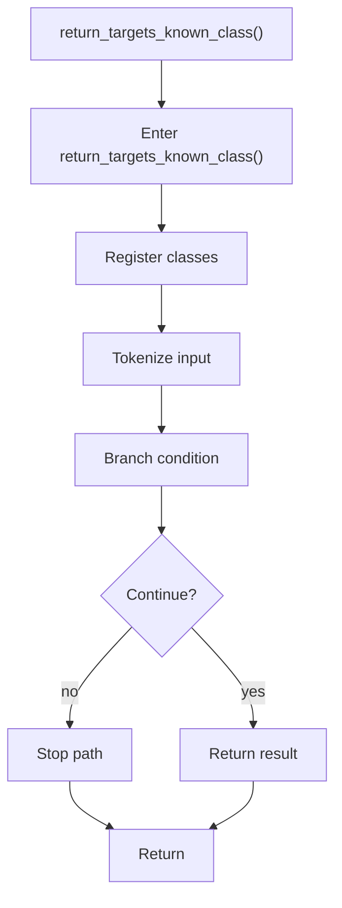

# return_targets_known_class.cpp

- Source document: [symbols_queries.cpp.md](../../symbols_queries.cpp.md)
- Purpose: decoupled implementation logic for a future code unit.

### return_targets_known_class()
This routine owns one focused piece of the file's behavior. It appears near line 94.

Inside the body, it mainly handles inspect or register class-level information, parse or tokenize input text, and branch on runtime conditions.

It branches on runtime conditions instead of following one fixed path. The caller receives a computed result or status from this step.

What it does:
- inspect or register class-level information
- parse or tokenize input text
- branch on runtime conditions

Flow:

