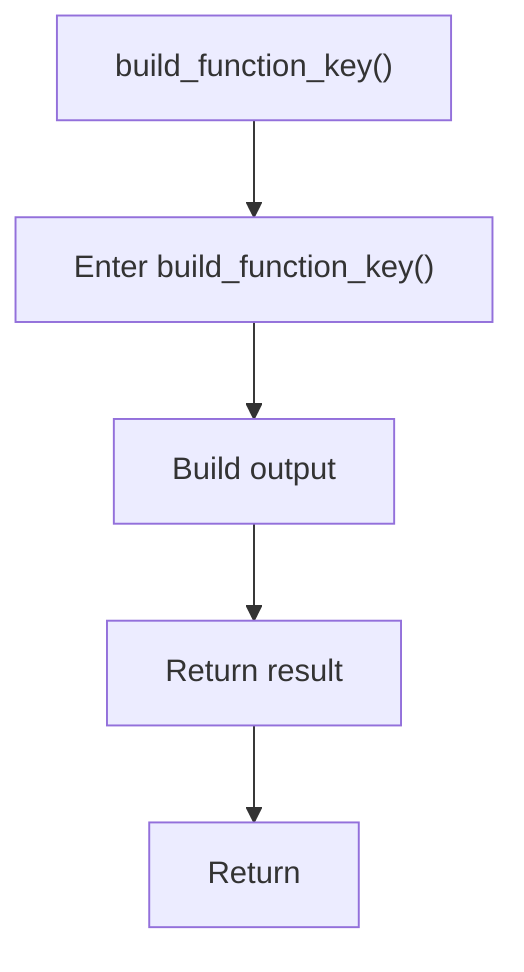

# build_function_key.cpp

- Source document: [symbols_utils.cpp.md](../../symbols_utils.cpp.md)
- Purpose: decoupled implementation logic for a future code unit.

### build_function_key()
This routine assembles a larger structure from the inputs it receives. It appears near line 120.

Inside the body, it mainly handles build or append the next output structure.

The caller receives a computed result or status from this step.

What it does:
- build or append the next output structure

Flow:

