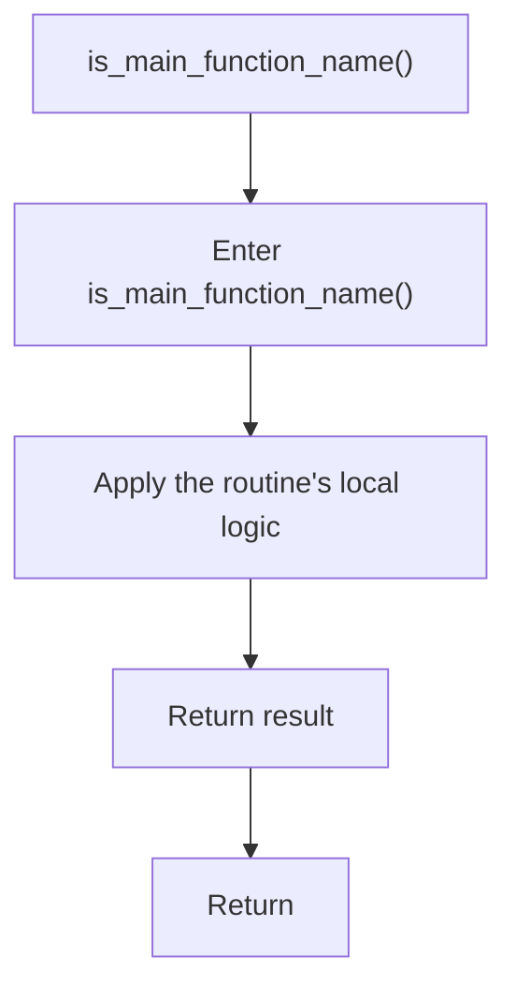

# is_main_function_name.cpp

- Source document: [symbols_utils.cpp.md](../../symbols_utils.cpp.md)
- Purpose: decoupled implementation logic for a future code unit.

### is_main_function_name()
This routine owns one focused piece of the file's behavior. It appears near line 131.

The caller receives a computed result or status from this step.

What it does:
- This routine is primarily structural and does not expose obvious runtime operations from static inspection.

Flow:

