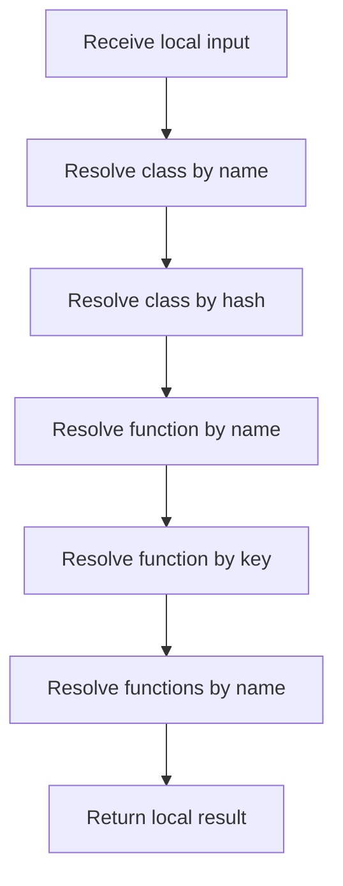

# symbols_queries.cpp

- Source: Microservice/Modules/Source/ParseTree/symbols_queries.cpp
- Kind: C++ implementation

## Story
### What Happens Here

This source file implements one internal part of the generic parse-tree engine. It contributes specialized behavior such as dependency handling, symbolization, hash-link construction, rendering, or older generation helpers after the raw tree exists. This source file implements one of the generic middle-stage services in the C++ pipeline. It is executed after sources are loaded and before the final report and rendered outputs are written.

### Why It Matters In The Flow

Runs across the middle of the microservice flow to build parse trees, hash links, symbol tables, documentation tags, reports, and rendered outputs.

### What To Watch While Reading

Implements parsing, shadow-tree building, symbolization, hash linking, rendering, and reporting. The main surface area is easiest to track through symbols such as class_symbol_table, function_symbol_table, class_usage_table, and find_class_by_name. It collaborates directly with Internal/parse_tree_symbols_internal.hpp, string, and vector.

## Program Flow
Quick summary: this diagram shows the file-local activity path for this implementation unit. It stays inside this code file and uses only entry and return boundaries as external references.

Why this slice is separate: deeper helper docs can explain individual functions, while this file still needs to show the main activity path in place.

Detailed program flow is decoupled into future implementation units:

- [program_flow](./symbols_queries/symbols_queries_program_flow.cpp.md)
## Reading Map
Read this file as: Implements parsing, shadow-tree building, symbolization, hash linking, rendering, and reporting.

Where it sits in the run: Runs across the middle of the microservice flow to build parse trees, hash links, symbol tables, documentation tags, reports, and rendered outputs.

Names worth recognizing while reading: class_symbol_table, function_symbol_table, class_usage_table, find_class_by_name, find_class_by_hash, and find_function_by_name.

It leans on nearby contracts or tools such as Internal/parse_tree_symbols_internal.hpp, string, and vector.

## Story Groups

### Finding What Matters
These steps pick out the facts, traces, and relationships that later stages need.
- find_class_by_name(): Search previously collected data, inspect or register class-level information, and walk the local collection
- find_class_by_hash(): Search previously collected data, compute or reuse hash-oriented identifiers, and inspect or register class-level information
- find_function_by_name(): Search previously collected data, walk the local collection, and branch on local conditions
- find_function_by_key(): Search previously collected data, walk the local collection, and branch on local conditions
- find_functions_by_name(): Search previously collected data, store local findings, and fill local output fields
- find_class_usages_by_name(): Search previously collected data, inspect or register class-level information, and store local findings

### Supporting Steps
These steps support the local behavior of the file.
- class_symbol_table(): Work with symbol-oriented state and inspect or register class-level information
- function_symbol_table(): Work with symbol-oriented state
- class_usage_table(): Inspect or register class-level information
- return_targets_known_class(): Inspect or register class-level information, read local tokens, and branch on local conditions

## Function Stories
Function-level logic is decoupled into future implementation units:

- [class_symbol_table](./symbols_queries/functions/class_symbol_table.cpp.md)
- [function_symbol_table](./symbols_queries/functions/function_symbol_table.cpp.md)
- [class_usage_table](./symbols_queries/functions/class_usage_table.cpp.md)
- [find_class_by_name](./symbols_queries/functions/find_class_by_name.cpp.md)
- [find_class_by_hash](./symbols_queries/functions/find_class_by_hash.cpp.md)
- [find_function_by_name](./symbols_queries/functions/find_function_by_name.cpp.md)
- [find_function_by_key](./symbols_queries/functions/find_function_by_key.cpp.md)
- [find_functions_by_name](./symbols_queries/functions/find_functions_by_name.cpp.md)
- [find_class_usages_by_name](./symbols_queries/functions/find_class_usages_by_name.cpp.md)
- [return_targets_known_class](./symbols_queries/functions/return_targets_known_class.cpp.md)
## Documentation Note
- This markdown file is part of the generated docs/Codebase mirror.
- It was generated from the repository state on 2026-04-23 after reading the existing docs corpus and the current source tree.
