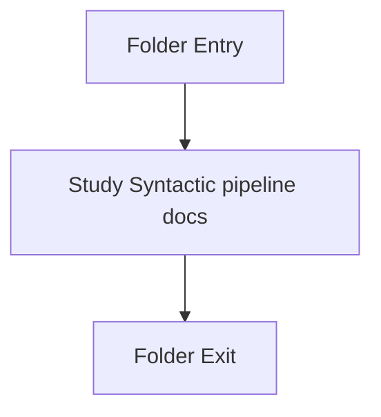

# Input-and-CLI

- Folder: docs/Codebase/Microservice/Modules/Source/Input-and-CLI
- Descendant source docs: 2
- Generated on: 2026-04-23

## Logic Summary
Input discovery, source loading, and command-argument handling for the syntactic subsystem.

## Subsystem Story
This folder is mostly leaf-level. The local documents here carry the main explanation of the subsystem without requiring much extra descent.

## Folder Flow

## Documents By Logic
### Syntactic Pipeline
These documents explain the local implementation by covering Normalizes the requested source and target pattern arguments before runtime execution begins. and Loads discovered source files into SourceFileUnit records and optional monolithic views.
- cli_arguments.cpp.md : Normalizes the requested source and target pattern arguments before runtime execution begins.
- source_reader.cpp.md : Loads discovered source files into SourceFileUnit records and optional monolithic views.

## Reading Hint
- This folder is mostly leaf-level. Read the local file docs to understand the logic in this area.

