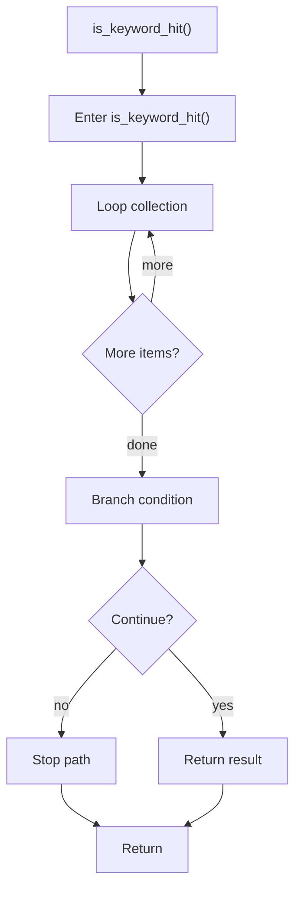

# is_keyword_hit.cpp

- Source document: [lexical_structure_hooks.cpp.md](../../lexical_structure_hooks.cpp.md)
- Purpose: decoupled implementation logic for a future code unit.

### is_keyword_hit()
This routine owns one focused piece of the file's behavior. It appears near line 38.

Inside the body, it mainly handles iterate over the active collection and branch on runtime conditions.

The implementation iterates over a collection or repeated workload. It branches on runtime conditions instead of following one fixed path. The caller receives a computed result or status from this step.

What it does:
- iterate over the active collection
- branch on runtime conditions

Flow:

