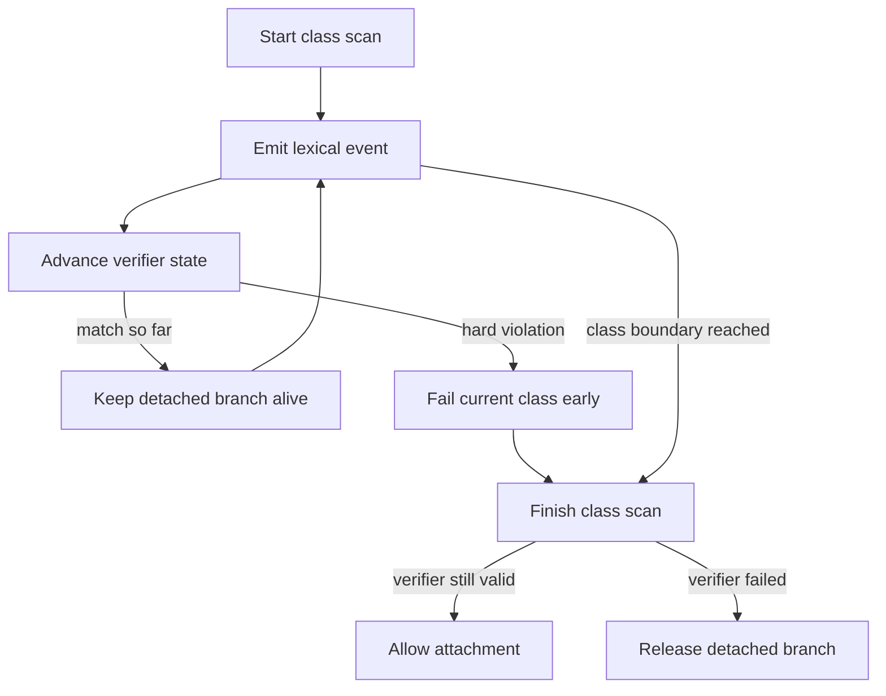

# `core.cpp`

- Folder: `docs/Codebase/Microservice/Modules/Source/Analysis/Lexical/StructureVerification`
- Role: implementation-ready plan for a strict lexical verifier that controls the virtual-broken branch per class

## Start Here
- Read this file first if you want the recommended verifier design before implementation starts.

## Quick Summary
- The verifier runs during lexical analysis, not after it.
- It consumes structural events for one class at a time.
- It can stop the current class candidate immediately on the first hard mismatch.
- The actual parse tree keeps growing, but the detached virtual-broken branch is allowed to grow only while the verifier is still alive.

## Core Rule
- The actual parse subtree must never look as if it is derived from the virtual copy.
- The verifier decides only whether the detached virtual-broken branch can continue.
- The actual branch records source truth regardless of verifier success or failure.

## Recommended Runtime Pieces
- `LexicalScanner`
  - tokenizes the active class and emits structural events
- `StructureEventStream`
  - events like `class_decl_seen`, `impl_scope_seen`, `member_seen`, `method_seen`, `scope_enter`, `scope_exit`
- `ExpectationVerifier`
  - consumes the event stream and tracks one class lifecycle
- `VirtualBrokenBuilder`
  - appends nodes only while the verifier remains valid
- `AttachmentGate`
  - attaches on class success or releases the detached branch on failure

## Verifier Lifecycle

## State Model
- One verifier instance per class candidate.
- Minimum states:
  - `Start`
  - `InClassDeclaration`
  - `InImplementationRegion`
  - `BuildingExpectedStructure`
  - `Matched`
  - `Failed`
- The verifier resets when the actual branch reaches the next class boundary.

## Hard Rules
- A hard rule fails immediately on the first contradiction.
- Good candidates for hard rules:
  - forbidden declaration order
  - missing mandatory structural marker after a required scope transition
  - forbidden implementation block inside an expected pattern shape
  - forbidden token or scope combination

## Optional Soft Rules
- Keep these out of the initial implementation unless you really need fuzzy matching.
- If introduced later, they should only rank survivors, never resurrect a failed class.

## Growth Rule
- `VirtualBrokenBuilder` can append nodes only after the verifier says the class still matches so far.
- On the first hard failure:
  - stop detached growth
  - release temporary allocation for that class
  - wait for the actual parse subtree to move to the next class

## Why This Scales Better
- New expected structures can be added as verifier definitions instead of rewriting the scanner.
- The scanner stays focused on event extraction.
- The verifier owns strict rule transitions.
- The builder owns detached branch growth.

## Acceptance Checks
- Verification is explicitly documented as happening during lexical analysis.
- Failure is explicitly documented as class-local and immediate.
- The actual branch is explicitly documented as independent from virtual-broken success.
- The docs never imply that actual tree construction is derived from the virtual copy.
