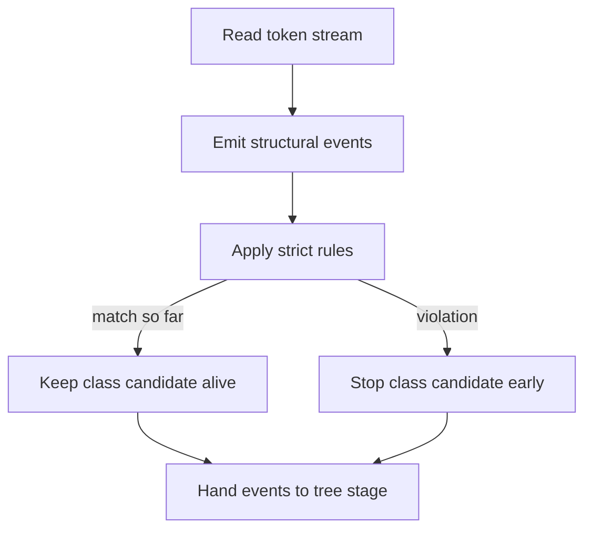

# `core.cpp`

- Folder: `docs/Codebase/Microservice/Modules/Source/Analysis/Lexical`
- Role: lexical-stage workflow for token scanning, structural event extraction, and strict expected-structure verification

## Start Here
- Read this file first if you want the lexical stage before dropping into token definitions, structural hooks, or structure verification.

## Quick Summary
- Lexical analysis is not only token scanning in this subsystem.
- It also emits structural events and runs strict expected-structure checks while classes are still being scanned.
- Those checks decide whether the detached virtual-broken branch is allowed to keep growing for the current class.

## Why This Folder Is Separate
- `Input/` loads raw sources.
- `Lexical/` turns those sources into structural facts and early pass or fail decisions.
- `Trees/` uses those decisions while keeping the actual parse tree rooted independently.

## Major Workflow

## Local Ownership
- `language_tokens.cpp.md` owns lexical token definitions.
- `StructuralHooks/` owns event extraction and structural signal collection.
- `StructureVerification/` owns strict expected-structure checking and fail-fast rules.

## Acceptance Checks
- Lexical analysis is documented as an active verifier, not only a passive scanner.
- Expected-structure failure can stop the current class candidate early.
- Tree generation is downstream from lexical events instead of redefining lexical rules on its own.
