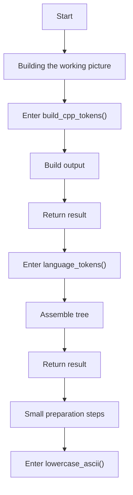
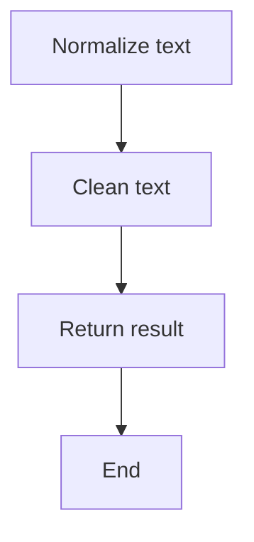
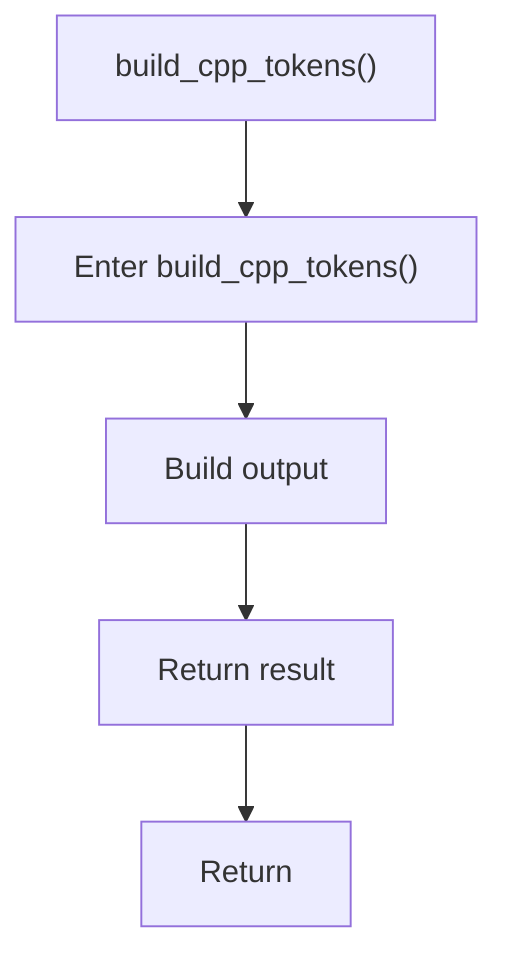
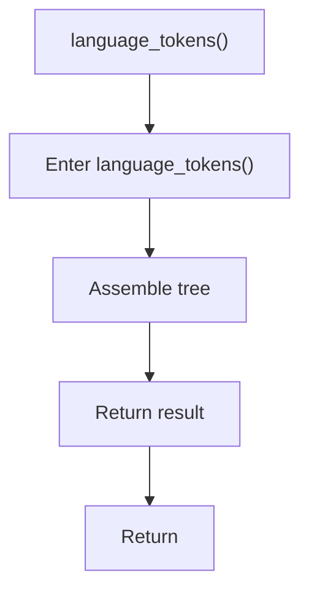
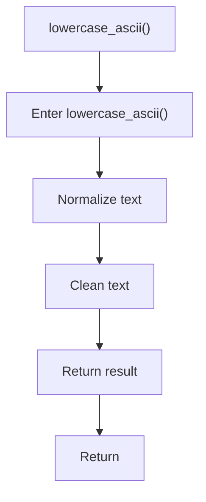

# language_tokens.cpp

- Source: Microservice/Modules/Source/Language-and-Structure/language_tokens.cpp
- Kind: C++ implementation
- Lines: 70

## Story
### What Happens Here

This source file implements one of the generic middle-stage services in the C++ pipeline. It is executed after sources are loaded and before the final report and rendered outputs are written.

### Why It Matters In The Flow

Runs across the middle of the microservice flow to build parse trees, hash links, symbol tables, documentation tags, reports, and rendered outputs.

### What To Watch While Reading

Implements parsing, shadow-tree building, symbolization, hash linking, rendering, and reporting. The main surface area is easiest to track through symbols such as build_cpp_tokens, language_tokens, std::runtime_error, and lowercase_ascii. It collaborates directly with Language-and-Structure/language_tokens.hpp, algorithm, cctype, and stdexcept.

## Program Flow
This diagram follows the action path in plain words. Decision diamonds show where the file can stop, branch, or repeat work instead of simply passing through a straight line.

The flow is intentionally split into smaller slices so the major intent of language_tokens.cpp stays readable. Each slice names the stage it is covering, gives a quick summary, and explains why that stage is separated from the next one.

### Program Flow Slices
#### Slice 1 - Opening Intent
Quick summary: This slice shows the opening intent of language_tokens.cpp and the first major actions that frame the rest of the flow.
Why this is separate: language_tokens.cpp has multiple branches, loops, or stage changes, so this section is split out to keep one major intent visible at a time instead of forcing one oversized diagram.

#### Slice 2 - Early Branches
Quick summary: This slice covers the first branch-heavy continuation of language_tokens.cpp after the opening path has been established.
Why this is separate: language_tokens.cpp has multiple branches, loops, or stage changes, so this section is split out to keep one major intent visible at a time instead of forcing one oversized diagram.

## Reading Map
Read this file as: Implements parsing, shadow-tree building, symbolization, hash linking, rendering, and reporting.

Where it sits in the run: Runs across the middle of the microservice flow to build parse trees, hash links, symbol tables, documentation tags, reports, and rendered outputs.

Names worth recognizing while reading: build_cpp_tokens, language_tokens, std::runtime_error, and lowercase_ascii.

It leans on nearby contracts or tools such as Language-and-Structure/language_tokens.hpp, algorithm, cctype, and stdexcept.

## Story Groups

### Small Preparation Steps
These steps clean up names, text, or small values before the larger work begins.
- lowercase_ascii() (line 61): Normalize or format text values and normalize raw text before later parsing

### Building The Working Picture
These steps assemble the trees, models, or bundles used by the rest of the file.
- build_cpp_tokens() (line 9): Build or append the next output structure
- language_tokens() (line 48): Assemble tree or artifact structures

## Function Stories

### build_cpp_tokens()
This routine assembles a larger structure from the inputs it receives. It appears near line 9.

Inside the body, it mainly handles build or append the next output structure.

The caller receives a computed result or status from this step.

What it does:
- build or append the next output structure

Flow:

### language_tokens()
This routine owns one focused piece of the file's behavior. It appears near line 48.

Inside the body, it mainly handles assemble tree or artifact structures.

The caller receives a computed result or status from this step.

What it does:
- assemble tree or artifact structures

Flow:

### lowercase_ascii()
This routine owns one focused piece of the file's behavior. It appears near line 61.

Inside the body, it mainly handles normalize or format text values and normalize raw text before later parsing.

The caller receives a computed result or status from this step.

What it does:
- normalize or format text values
- normalize raw text before later parsing

Flow:

## Documentation Note
- This markdown file is part of the generated docs/Codebase mirror.
- It was generated from the repository state on 2026-04-23 after reading the existing docs corpus and the current source tree.

