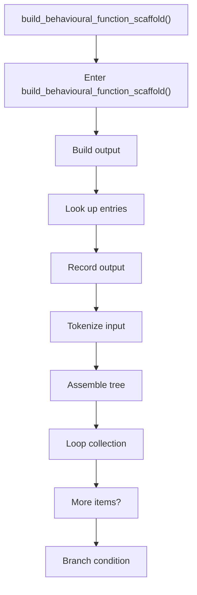
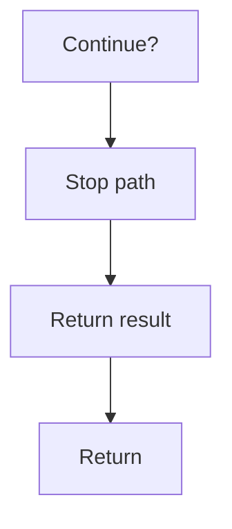

# build_behavioural_function_scaffold.cpp

- Source document: [behavioural_logic_scaffold.cpp.md](../../behavioural_logic_scaffold.cpp.md)
- Purpose: decoupled implementation logic for a future code unit.

### build_behavioural_function_scaffold()
This routine assembles a larger structure from the inputs it receives. It appears near line 267.

Inside the body, it mainly handles build or append the next output structure, look up entries in previously collected maps or sets, record derived output into collections, and parse or tokenize input text.

The implementation iterates over a collection or repeated workload. It branches on runtime conditions instead of following one fixed path. The caller receives a computed result or status from this step.

What it does:
- build or append the next output structure
- look up entries in previously collected maps or sets
- record derived output into collections
- parse or tokenize input text
- assemble tree or artifact structures
- iterate over the active collection
- branch on runtime conditions

Flow:

### Block 5 - build_behavioural_function_scaffold() Details
#### Slice 1 - Opening Intent
Quick summary: This slice shows the opening intent of build_behavioural_function_scaffold.cpp and the first major actions that frame the rest of the flow.
Why this is separate: build_behavioural_function_scaffold.cpp has multiple branches, loops, or stage changes, so this section is split out to keep one major intent visible at a time instead of forcing one oversized diagram.

#### Slice 2 - Early Branches
Quick summary: This slice covers the first branch-heavy continuation of build_behavioural_function_scaffold.cpp after the opening path has been established.
Why this is separate: build_behavioural_function_scaffold.cpp has multiple branches, loops, or stage changes, so this section is split out to keep one major intent visible at a time instead of forcing one oversized diagram.

