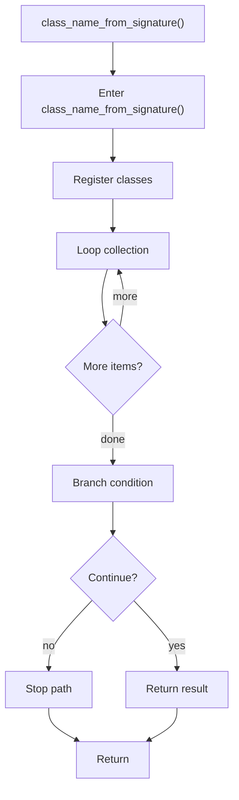

# class_name_from_signature.cpp

- Source document: [behavioural_logic_scaffold.cpp.md](../../behavioural_logic_scaffold.cpp.md)
- Purpose: decoupled implementation logic for a future code unit.

### class_name_from_signature()
This routine owns one focused piece of the file's behavior. It appears near line 65.

Inside the body, it mainly handles inspect or register class-level information, iterate over the active collection, and branch on runtime conditions.

The implementation iterates over a collection or repeated workload. It branches on runtime conditions instead of following one fixed path. The caller receives a computed result or status from this step.

What it does:
- inspect or register class-level information
- iterate over the active collection
- branch on runtime conditions

Flow:

